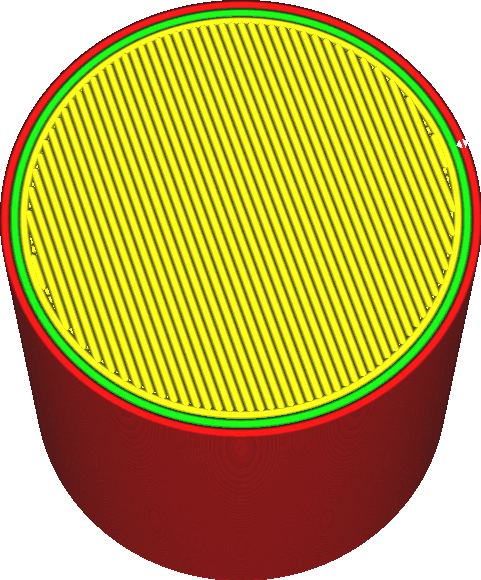
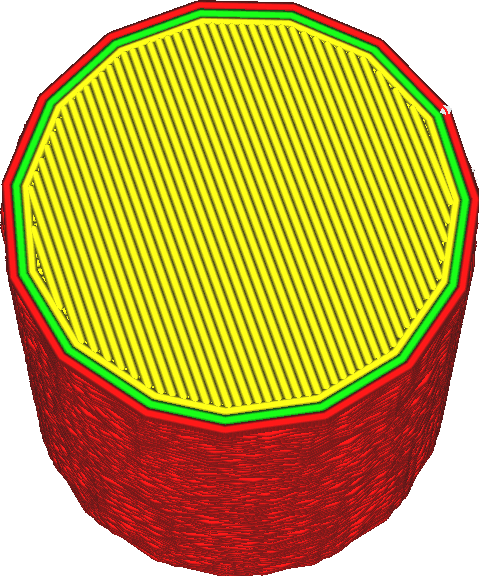

Maximale Abweichung
====
Während Eingaben mit hoher Auflösung auf den ersten Blick besser erscheinen mögen, kommt der Drucker mit hochauflösendem G-Code oft nicht gut zurecht. Daher wird Cura die Auflösung der Eingabe während des Slicing-Prozesses reduzieren. Diese Einstellung bestimmt, wie weit der reduzierte Pfad vom Originalpfad abweichen darf, um die Auflösung zu reduzieren.

<!--screenshot {
"image_path": "meshfix_maximum_resolution_0.05.png",
"models": [{"script": "cylinder.scad"}],
"camera_position": [40, -20, 116],
"settings": {
    "meshfix_maximum_resolution": 0.05
},
"colours": 64
}-->
<!--screenshot {
"image_path": "meshfix_maximum_resolution_1.png",
"models": [{"script": "cylinder.scad"}],
"camera_position": [40, -20, 116],
"settings": {
    "meshfix_maximum_resolution": 4,
    "meshfix_maximum_deviation": 0.5
},
"colours": 64
}-->

Der Drucker muss den G-Code verarbeiten, während er ausgeführt wird. Wenn der G-Code viele kleine Zeilensegmente enthält, kann der Druckkopf so schnell durch die Bewegung rasen, dass der Prozessor des 3D-Druckers nicht mithalten kann. Dies hat zur Folge, dass der Druckkopf sporadisch langsamer wird, damit die CPU aufholen kann oder einfach nur auf den nächsten Bewegungsbefehl wartet. Dies führt dazu, dass die Oberfläche sehr rau wird oder sogar kleine Kleckse aufweist, weil die Flussrate aus der Düse nicht perfekt mit der sporadischen Bewegung der Düse übereinstimmt. Manchmal führt eine niedrigere Auflösung zu einer besseren Druckqualität.

Diese Einstellung gibt an, wie weit der neue, in der Auflösung reduzierte Pfad von dem ursprünglichen, hochauflösenden Pfad abweichen darf. Es wird davon ausgegangen, dass Linien mit anderen Liniensegmenten verbunden werden, wenn sie kürzer als die [Maximale Auflösung](meshfix_maximum_resolution.md) sind. Wenn diese Reduzierung jedoch dazu führen würde, dass der Pfad mehr als die durch diese Einstellung angegebene Entfernung abweicht, werden die Linien nicht verbunden.

Beachten Sie, dass es nicht garantiert ist, dass dieselben Eckpunkte aus jeder Schicht entfernt werden, wenn die Eckpunkte zufällig übereinstimmen. Die Auflösungsreduzierung wird in 2D durch das Entfernen von Eckpunkten der Formen der Schicht durchgeführt, nicht in 3D durch das Entfernen von Eckpunkten des Netzes. Folglich führt eine zu starke Reduzierung der Auflösung oft zu einer unregelmäßigen Oberfläche statt zu einer kantigen Oberfläche.

Aufgrund der strukturellen Integrität wird dringend empfohlen, dass Pfade nicht um mehr als eine halbe Linienbreite abweichen dürfen. Wenn die Oberfläche jedoch glatt sein oder schön aussehen soll, gibt diese Einstellung im Wesentlichen an, wie stark die Unregelmäßigkeiten auf der Oberfläche sein dürfen. Die maximale Abweichung muss so gering sein, dass sie mit dem bloßen Auge nicht zu erkennen ist.

Wenn Sie die maximale Abweichung jedoch zu stark reduzieren, wird die Auflösung stark verringert. Der resultierende g-Code wird dann möglicherweise nicht gut gedruckt, da die CPU nicht in der Lage ist, mit den kurzen Bewegungsbefehlen Schritt zu halten.