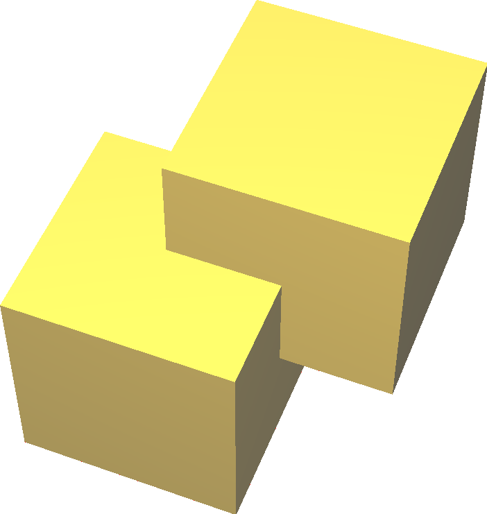
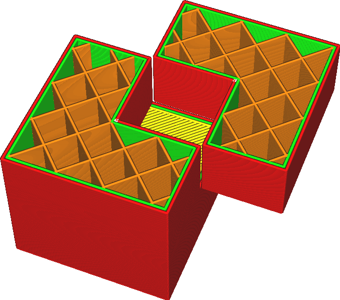
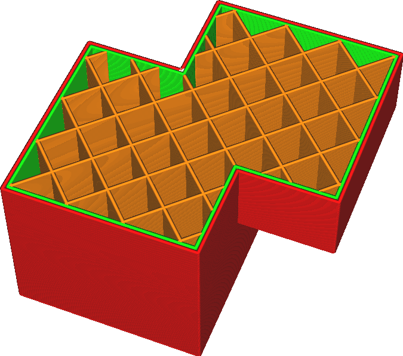

Überlappende Volumen vereinen
====
Wenn ein Modell mehrere Körper enthält, die sich überschneiden, wird der Körper, der sich innerhalb beider Körper befindet, normalerweise nicht ausgefüllt. Diese Einstellung bewirkt, dass Cura die internen Strukturen ignoriert und einfach alle füllt, unabhängig davon, wie viele Schichten sich um den Körper befinden.

<!--screenshot {
"image_path": "meshfix_union_all_shell.png",
"models": [{"script": "intersecting_cubes.py"}],
"camera_position": [34, 86, 132],
"layer": -1,
"colours": 128
}-->
<!--screenshot {
"image_path": "meshfix_union_all_disabled.png",
"models": [{"script": "intersecting_cubes.py"}],
"camera_position": [34, 86, 132],
"settings": {"meshfix_union_all": false},
"layer": 300,
"colours": 64
}-->
<!--screenshot {
"image_path": "meshfix_union_all_enabled.png",
"models": [{"script": "intersecting_cubes.py"}],
"camera_position": [34, 86, 132],
"settings": {"meshfix_union_all": true},
"layer": 300,
"colours": 64
}-->

Technisch gesehen ändert diese Einstellung die Regel von [Even-Odd](https://en.wikipedia.org/wiki/Even%E2%80%93odd_rule) zu [Nonzero](https://en.wikipedia.org/wiki/Nonzero-rule). Normalerweise wird ein Volumen gefüllt, wenn es von einer ungeraden Anzahl von Schichten umgeben ist. Wenn diese Einstellung aktiviert ist, wird es gefüllt, wenn es von einer von Null verschiedenen Anzahl von Schichten umgeben ist.

**Dies funktioniert nur für Körpern innerhalb desselben Modells. Wenn Sie mehrere Dateien geladen haben und diese in Cura überschneiden, wird diese Einstellung keine Auswirkungen haben. Vergleichen Sie die Einstellung Netzüberschneidung entfernen, um Probleme mit mehreren separaten Netzen zu beheben, die sich überschneiden.**