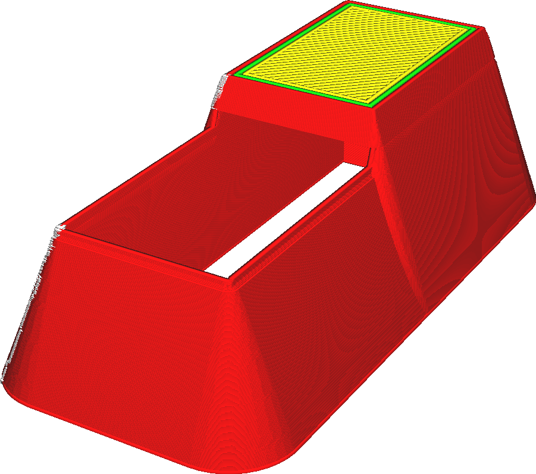
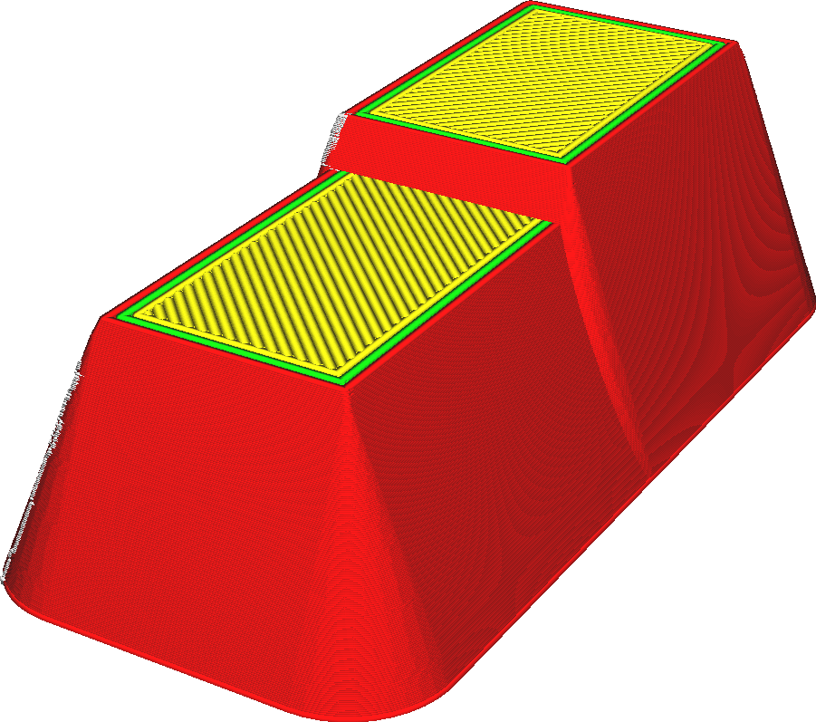

Alle Löcher entfernen
====
Einige Modelle, vor allem solche, die für Fertigungstechniken wie Spritzguss hergestellt werden, haben oft innere Hohlräume, die nicht sichtbar sind. Wenn diese Einstellung aktiviert ist, entfernt Cura diese inneren Hohlräume.

<!--screenshot {
"image_path": "meshfix_union_all_remove_holes_disabled.png",
"models": [{"script": "foothold.scad"}],
"camera_position": [-68, 40, 46],
"settings": {"meshfix_union_all_remove_holes": false},
"colours": 64
}-->
<!--screenshot {
"image_path": "meshfix_union_all_remove_holes_enabled.png",
"models": [{"script": "foothold.scad"}],
"camera_position": [-68, 40, 46],
"settings": {"meshfix_union_all_remove_holes": true},
"colours": 64
}-->

Die Hohlräume auf der Innenseite sind vielleicht dazu gedacht, Material zu sparen, aber beim 3D-Druck gibt es einige Einschränkungen, die dazu führen, dass diese Modelle schlechter gedruckt werden. Beispielsweise kommen 3D-Drucker nicht gut mit dünnen Wänden zurecht, die nicht ein Vielfaches der Linienbreite betragen, und die obere Schicht neigt zum durchhängen, wenn sie nicht durch Füllmaterial unterstützt wird. Im Allgemeinen ist es besser, ein solides Netz zu erstellen und dem Slicer die Entscheidung zu überlassen, wie es gefüllt werden soll. Mit dieser Mesh-Fix-Einstellung können Sie das tun, ohne das Mesh bearbeiten zu müssen.

Cura prüft nur in horizontaler Richtung, ob ein Hohlraum vollständig umschlossen ist. Es wird nicht geprüft, ob ein Hohlraum von oben oder unten offen ist. Der Unterschied kann von oben oder unten noch sichtbar sein.