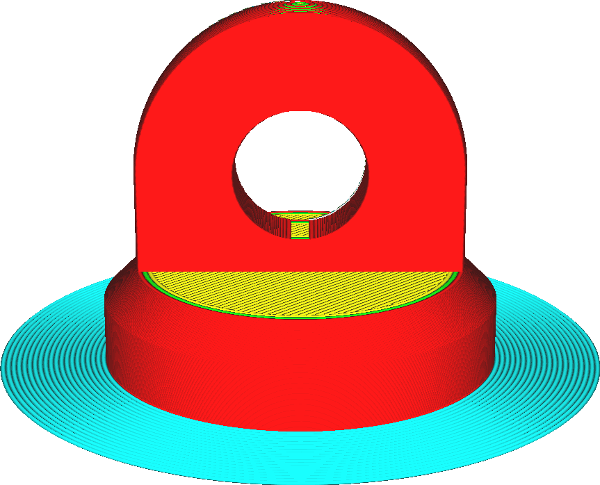
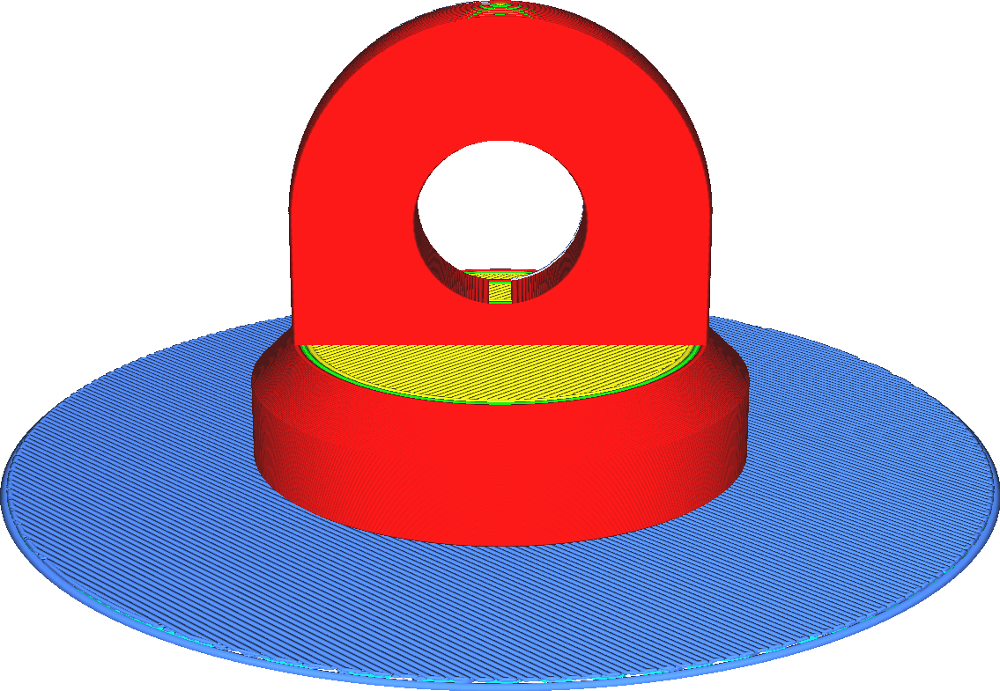

Druckplattenhaftungstypen
====
Es gibt drei Arten für die Haftung auf der Bauplatte: Skirt, Brim und Raft. Sie können die Haftarten auch einfach deaktivieren, indem Sie "Keine" einstellen.

<!--screenshot {
"image_path": "adhesion_type_skirt.png",
"models": [
    {
        "script": "stamp.scad",
        "transformation": ["scale(0.5)"]
    }
],
"camera_position": [0, 128, 53],
"settings": {"adhesion_type": "skirt"},
"colours": 64
}-->
<!--screenshot {
"image_path": "adhesion_type_brim.png",
"models": [
    {
        "script": "stamp.scad",
        "transformation": ["scale(0.5)"]
    }
],
"camera_position": [0, 128, 53],
"settings": {"adhesion_type": "brim"},
"colours": 64
}-->
<!--screenshot {
"image_path": "adhesion_type_raft.png",
"models": [
    {
        "script": "stamp.scad",
        "transformation": ["scale(0.5)"]
    }
],
"camera_position": [0, 128, 53],
"settings": {"adhesion_type": "raft"},
"colours": 64
}-->

Skirt
----
Ein Skirt ist eine einzelne Linie, die Ihren Druck umgibt. Sie trägt nicht direkt zu einer besseren Plattenhaftung bei. Wenn Sie jedoch die anderen Methoden nicht verwenden möchten, erfüllt diese Methode zwei Funktionen.
* Sie bewirkt, dass Ihre Düse vor dem Druck Ihres eigentlichen Modells gefüllt wird, um sicherzustellen, dass das Material richtig fließt.
* Es ermöglicht Ihnen zu sehen, ob Ihre Bauplatte richtig nivelliert ist.

Brim
----
Ein Brim ist ein einschichtiger flacher Bereich um die Basis Ihres Modells. Sein Zweck ist es, die Ränder Ihres Drucks unten zu halten und die Kontaktfläche zwischen Ihrem Druck und der Bauplatte größer zu machen.
* Durch die größere Oberfläche kann der Druck besser auf der Bauplatte haften. Dies ist für so ziemlich jeden Druck nützlich, der größer als ein paar Zentimeter ist.
* Dieser Rand hält auch die Ränder des Drucks unten. Materialien, die beim Abkühlen stark schrumpfen (wie ABS), neigen dazu, sich beim Drucken stark zu verziehen. Ein ausreichend breiter Rand kann die Ecken an Ort und Stelle halten und diese Verformung verhindern.

Raft
----
Ein Raft ist eine dicke Platte zwischen dem Modell und der Bauplatte. Diese Platte schirmt den Druck vor der Hitze der Bauplatte ab. Außerdem hat es eine große Oberfläche, mit der es an der Bauplatte haften kann. Der Druck wird auf diese Platte gelegt, wo er viel besser haften kann. Seien Sie jedoch vorsichtig bei dünnen Drucken, da es schwierig sein kann, das Raft zu entfernen, ohne den Druck zu beschädigen.