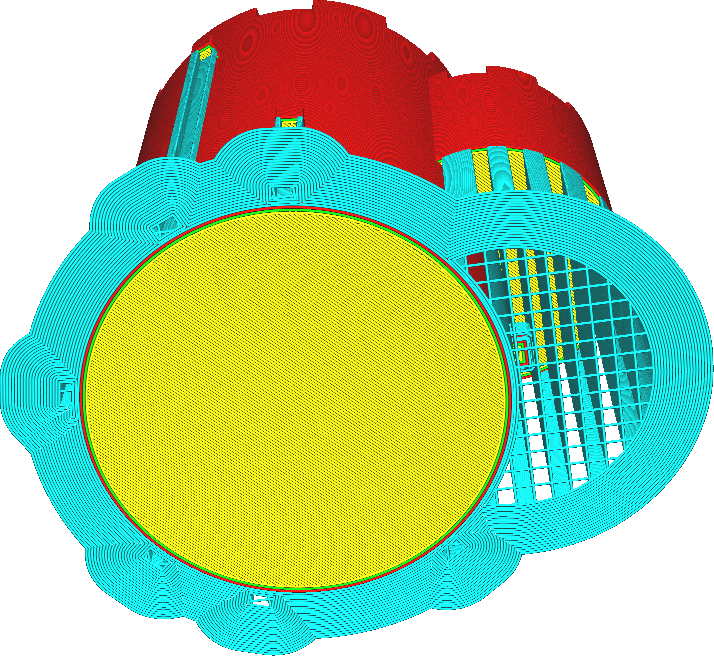
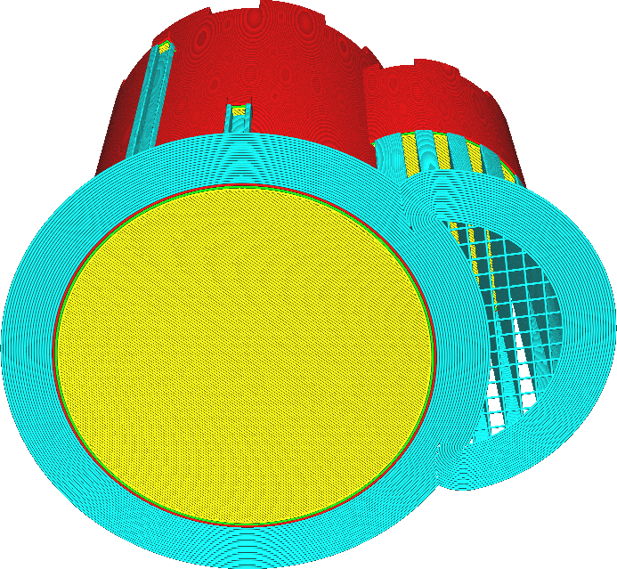

Brim ersetzt die Stützstruktur
====
Wenn diese Einstellung aktiviert ist, folgt der Brim weiterhin dem Modell unter dem Support, anstatt um den Support herum zu gehen. Der Support wird dann in der nächsten Schicht über den Brim gedruckt. Es wird auch weiterhin ein Brim um den Support herum gedruckt.

<!--screenshot {
"image_path": "brim_replaces_support_disabled.png",
"models": [{"script": "castle.scad"}],
"camera_position": [0, 100, -136],
"settings": {
    "adhesion_type": "brim",
    "support_enable": true,
    "brim_replaces_support": false
},
"colours": 64
}-->
<!--screenshot {
"image_path": "brim_replaces_support_enabled.png",
"models": [{"script": "castle.scad"}],
"camera_position": [0, 100, -136],
"settings": {
    "adhesion_type": "brim",
    "support_enable": true,
    "brim_replaces_support": true
},
"colours": 64
}-->

Wenn Sie diese Einstellung aktivieren, kann der Brim dem Modell besser folgen. Infolgedessen wird das Modell besser an der Bauplatte gehalten, was ein Verziehen verhindert.

In einigen Fällen wird dadurch die Gesamtbreite des Brims für einige Teile des Supports verringert. In diesen Fällen liegt der Support jedoch so nah am Modell, dass der Brim mit dem Modell verschmilzt, so dass es hier kaum zu Problemen mit der Haftung kommt.