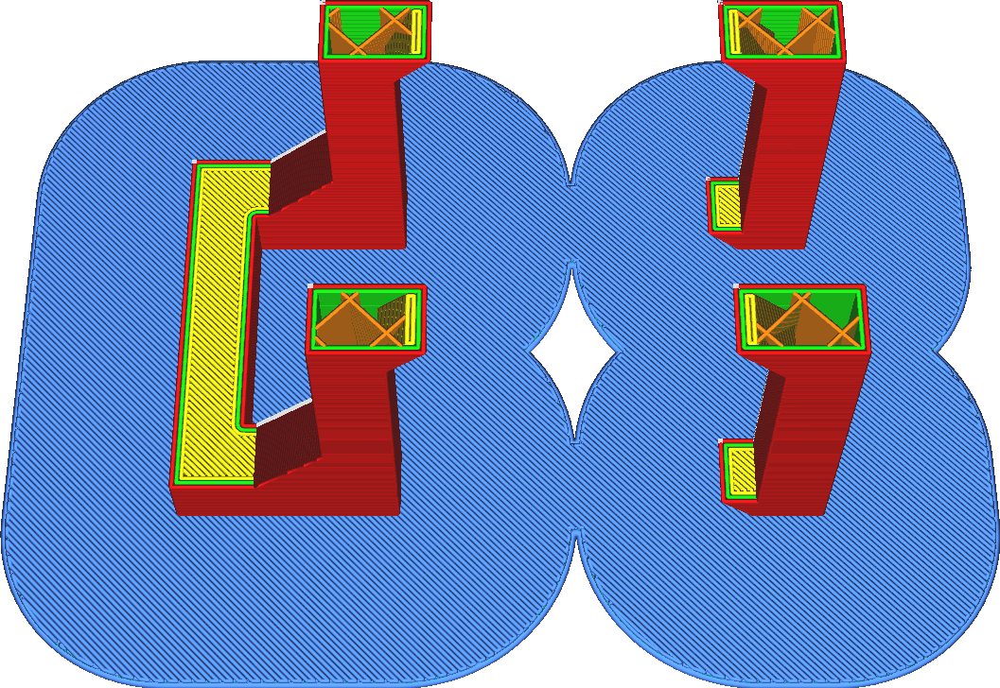

Raft-Glättung
====
Mit dieser Einstellung können die inneren Ecken des Rafts glatter gemacht werden. Die Einstellung gibt den Radius eines Bogens an. Alle Innenecken, die schärfer sind als der angegebene Bogenradius, werden geglättet, um den Bogenradius zu erhalten.

<!--screenshot {
"image_path": "raft_smoothing_0mm.png",
"models": [{"script": "question_stick_clip.scad"}],
"camera_position": [0, 97, 191],
"settings": {
    "adhesion_type": "raft",
    "raft_smoothing": 0
},
"layer": 509,
"colours": 64
}-->
<!--screenshot {
"image_path": "raft_smoothing_5mm.png",
"models": [{"script": "question_stick_clip.scad"}],
"camera_position": [0, 97, 191],
"settings": {
    "adhesion_type": "raft",
    "raft_smoothing": 5
},
"layer": 509,
"colours": 64
}-->

Der Fachbegriff dafür ist [morphologische Schließung](https://en.wikipedia.org/wiki/Closing_\(morphology\)). Alle Löcher, die kleiner als der angegebene Radius sind, werden geschlossen. Die schärfen Innenecken werden dadurch entschärft.

Die Funktion dieser Einstellung besteht darin, das Raft steifer zu machen. Wenn mehrere Teile durch dünne Verbindungen miteinander verbunden sind, kann sich das Raft an diesen Stellen biegen. Das macht es weniger steif und weniger widerstandsfähig gegen Verformung. Wenn Sie diese Einstellung erhöhen, werden die einzelnen Teile besser miteinander verbunden, wodurch das Raft stabiler wird. Die Oberfläche des Floßes wird größer, so dass das Raft besser haftet. Außerdem hat das Raft insgesamt einen geringeren Umfang, so dass es weniger Stellen gibt, an denen es sich verziehen kann. Der Verzug sollte also insgesamt geringer sein.

Allerdings wird auch das Gesamtvolumen des Rafts vergrößert. Dadurch wird mehr Material verbraucht und das Drucken dauert länger, zumal das Raft normalerweise sehr langsam gedruckt wird.