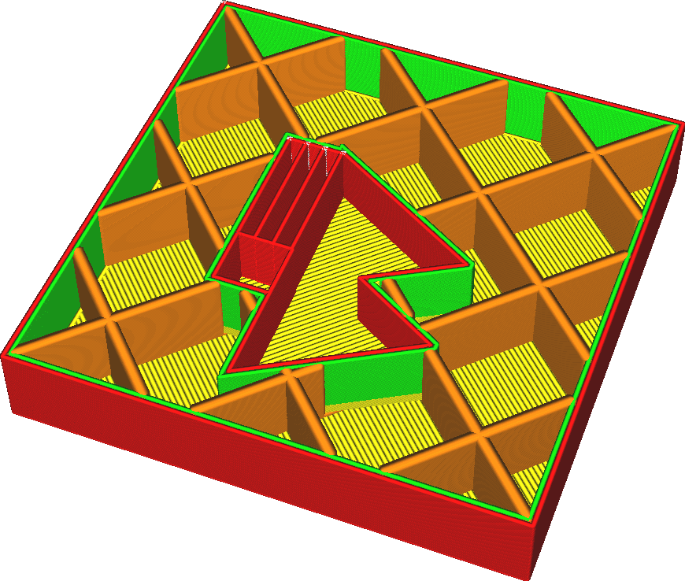

Breite der Fülllinien
====
Die Breite jeder gezeichneten Fülllinie. Die Breite einer Linie kann von der Düsengröße abweichen, indem einfach mehr oder weniger Material als erforderlich extrudiert wird. Wenn mehr Material extrudiert wird, fließt der Kunststoff zu den Seiten hin und macht die Linie dicker. Wird weniger Material extrudiert, zieht die Oberflächenspannung des Materials das Material in Richtung der Mittellinie des Düsenwegs.

<!--screenshot {
"image_path": "infill_line_width.png",
"models": [{"script": "material_calibration.scad"}],
"camera_position": [35, 92, 122],
"settings": {"infill_line_width": 1},
"layer": 111,
"colours": 64
}-->

Wenn Sie die Fülllinien breiter machen, kann Ihr Druck stabiler werden und auch die Druckzeit verkürzen. Eine zu starke Vergrößerung kann jedoch zu großen Extrusionsschwankungen führen. Dies führt zu einer Unterextrusion beim Druck der Füllung und zu einer Überextrusion beim Druck dessen, was nach der Füllung kommt, da sich der Fluss durch die Düse nicht schnell genug anpassen kann.

**Die tatsächlichen Fülllinien können breiter ausfallen als in dieser Einstellung angegeben, wenn Sie die Einstellung [Füllschichtdicke] (../infill/infill_sparse_thickness.md) angepasst haben.**