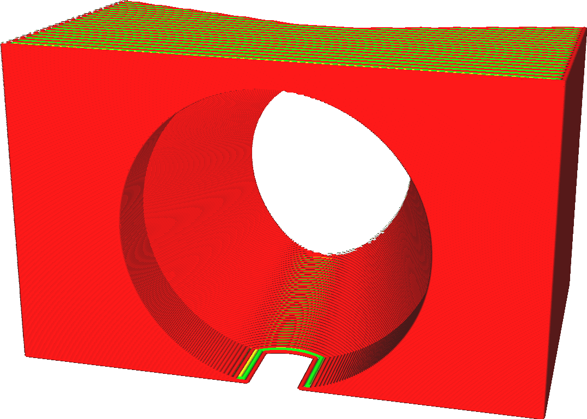
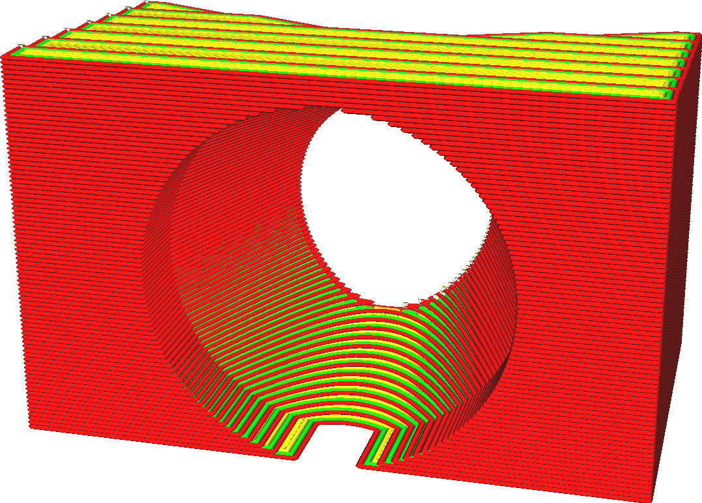

Schichtdicke
====
Der 3D-Drucker trägt den Kunststoff in Schichten auf. Die Schichtdicke ist die Höhe dieser Schichten in Millimetern. Sie ist der wichtigste Faktor sowohl für die visuelle Qualität des endgültigen Drucks als auch für die Druckzeit.

<!--screenshot {
"image_path": "layer_height_0.1.png",
"models": [{"script": "plunger_stop.scad"}],
"camera_position": [25, 100, 50],
"settings": {"layer_height": 0.1},
"colours": 32
}-->
<!--screenshot {
"image_path": "layer_height_0.3.png",
"models": [{"script": "plunger_stop.scad"}],
"camera_position": [25, 100, 50],
"settings": {"layer_height": 0.3},
"colours": 32
}-->

Die Schichtdicke ist die wichtigste Einstellung, die die Gesamtqualität und umgekehrt die Druckzeit beeinflusst. Dies sind nur einige der Auswirkungen:
* Dünnere Schichten erhöhen die visuelle Qualität des Drucks. Da die Schichten dünner sind, wird der Treppeneffekt an den Rändern der Schichten verringert. Außerdem liegen die Schichten dichter beieinander, so dass die Rillen zwischen den Schichten kleiner sind, was insgesamt zu einem glatteren Ergebnis führt.
* Dünnere Schichten ermöglichen es dem Drucker, mehr Details auf der Ober- und Unterseite des Drucks zu erzeugen.
* Dickere Schichten machen den Druck bis zu einem gewissen Grad stabiler. Es gibt weniger Ränder zwischen den Schichten, die normalerweise eine Schwachstelle darstellen. Die dickeren Schichten scheren nicht so stark ab.
* Dickere Schichten verkürzen die Druckzeit, da die Düse nicht so viele horizontale Bewegungen machen muss.

Schichtdicke vs. Profile
----
Viele Einstellungen hängen von der Schichthöhe ab. Da die Schichthöhe die Fließgeschwindigkeit des Materials durch die Düse erheblich beeinflusst, ändern sich viele Parameter des Druckprozesses. Dies ist sehr komplex. Wenn Sie zum Beispiel die Schichtdicke erhöhen, sollten Sie wahrscheinlich auch die Drucktemperatur leicht erhöhen, um den zusätzlichen Wärmeverlust auszugleichen. Die Temperatur wirkt sich dann auf die Fließfähigkeit des Materials aus, was sich wiederum darauf auswirkt, wie scharf die Ecken sein werden und welche Kühlung erforderlich ist usw. Es ist immer ratsam, von einem vorgefertigten Qualitätsprofil auszugehen, das Ihrem Drucker zur Verfügung steht und eine Schichtdicke aufweist, die Ihren Wünschen entspricht.

Im benutzerdefinierten Modus können Sie die gewünschte Schichtdicke wählen, aber es sind auch vorgefertigte Profile mit verschiedenen Schichtdicken verfügbar. Sie können im empfohlenen Modus mithilfe eines Schiebereglers oder im benutzerdefinierten Modus mithilfe des Dropdown-Widgets aus Profilen für verschiedene Schichtdicke wählen. Da diese Profile auch einige Parameter ändern, die von der Schichtdicke abhängen, erzielen Sie auf diese Weise wahrscheinlich eine bessere Qualität.

Zusätzliche Hinweise
----
Bei sehr geringen Schichtdicken könnten Sie an die Grenzen der Auflösung Ihrer Z-Achse stoßen. Schlagen Sie die Schrittweite der Z-Achse Ihres Druckers nach und stellen Sie sicher, dass die Schichtdicke ein Vielfaches davon ist. Wenn dies nicht der Fall ist, werden einige Schichten dicker als andere sein, was zu Streifenbildung führt.

**Beachten Sie, dass die Einstellung der Schichtdicke nicht für die erste Schicht des Drucks oder für die Raftschichten gilt, da diese über eigene Einstellungen zur separaten Anpassung der Schichtdicke verfügen. Bei der Verwendung von adaptiven Schichten wird diese Schichtdickeneinstellung als Grundlinie verwendet, aber die tatsächliche Schichtdicke wird etwas variieren.**