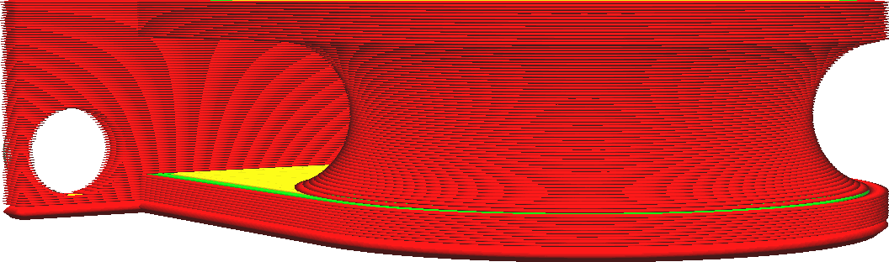

Dicke der ersten Schicht
====
Mit dieser Einstellung wird die Dicke der ersten Schicht Ihres Drucks festgelegt. Die erste Schicht wird normalerweise dicker als der Rest gedruckt, um eine stärkere Haftung mit der Bauplatte zu erreichen. Mit dieser Einstellung kann die Dicke der ersten Schicht erhöht werden, ohne die Auflösung des restlichen Drucks zu verringern.

<!--screenshot {
"image_path": "layer_height_0.png",
"models": [
    {
        "script": "rolling_blind_spacer.scad",
        "transformation": ["scale(0.5)"]
    }
],
"camera_position": [39, 28, 5],
"settings": {"layer_height_0": 0.3},
"colours": 32
}-->

Wenn die Dicke der ersten Schicht erhöht wird, muss die Düse mehr Material über die gleiche Strecke extrudieren. Dies erfordert zusätzliche Kraft, da sich das Material zu den Seiten hin ausbreitet, um die gesamte Linienbreite zu füllen. Diese zusätzliche Kraft bewirkt, dass das Material besser an der Bauplatte haftet. Außerdem fängt die dickere Schicht alle Unregelmäßigkeiten in der Oberfläche auf. Wenn die Bauplatte leicht gebogen ist, wird die Unebenheit durch die Dicke der ersten Schicht aufgefangen, während die Düse sie sonst in der zweiten Schicht abkratzen könnte.

Eine zu dicke Anfangsschicht führt dazu, dass die erste Schicht stärker nachgibt, was zu Elefantenfüßen führt. Die Einstellung [Horizontale Erweiterung erste Schicht](../shell/xy_offset_layer_0.md) kann dies verhindern, indem sie einen kleinen negativen Wert angibt.