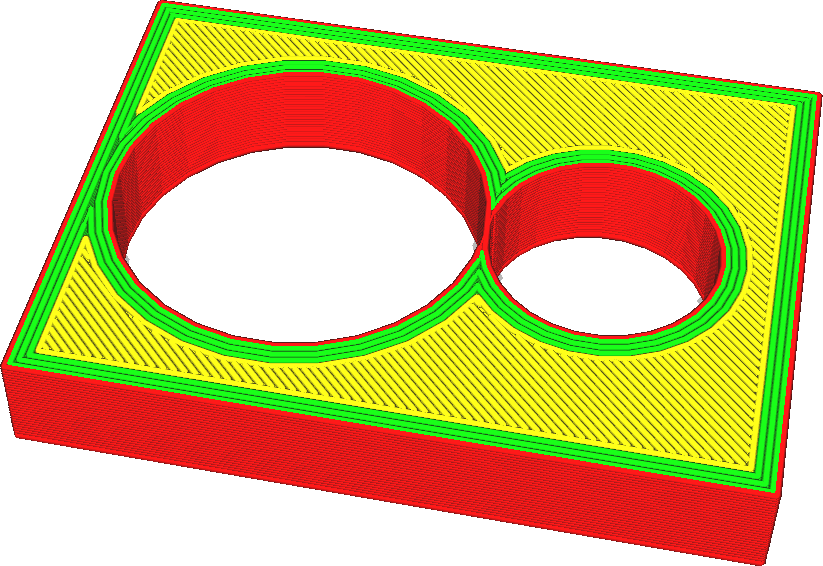
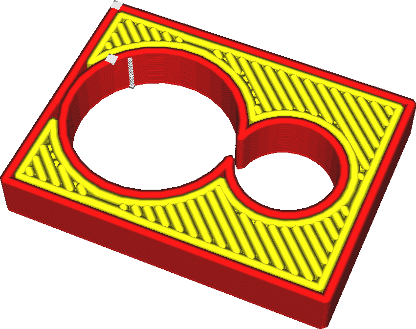
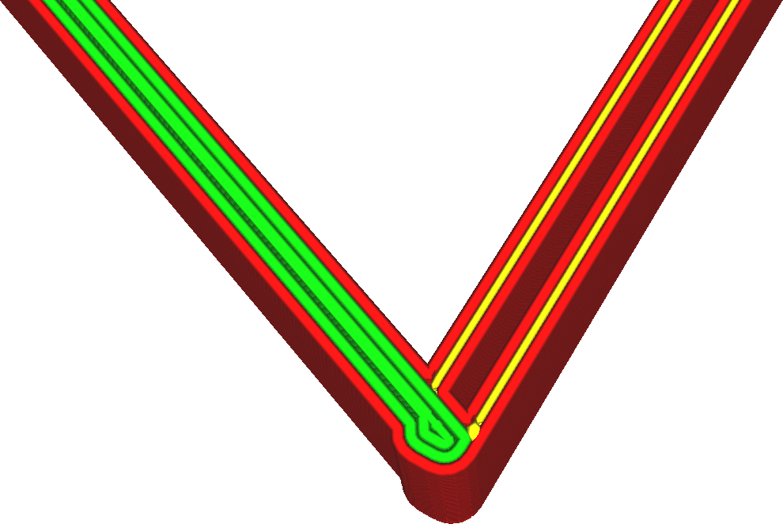
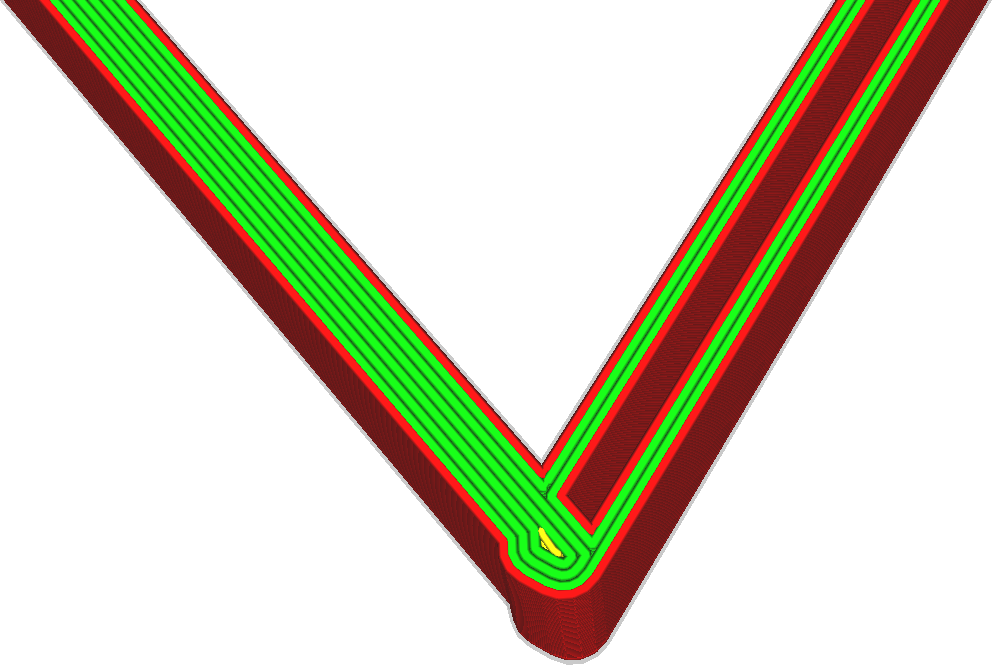
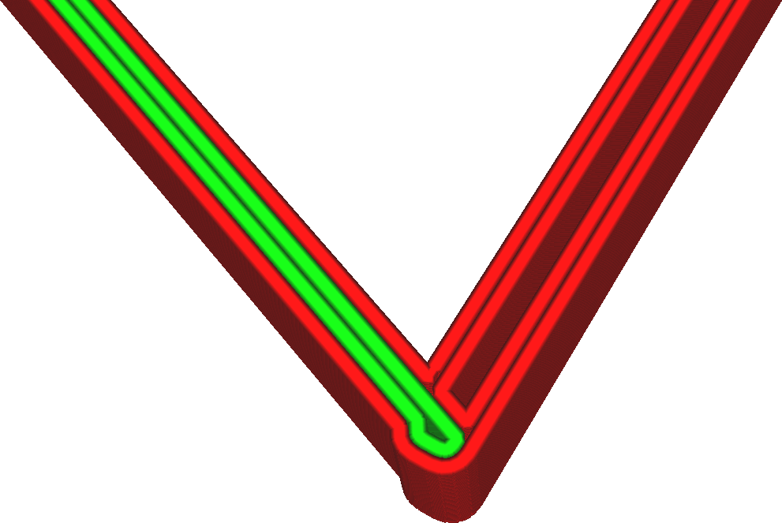

Linienbreite
====
Dies ist die horizontale Breite der Linien, die der Drucker aufträgt. Normalerweise bestimmt der Durchmesser der Düsenöffnung, wie breit Ihre Linien sein werden, aber durch das Extrudieren von mehr oder weniger Material kann der Drucker ein wenig variieren, wie breit die Linien werden.

<!--screenshot {
"image_path": "line_width_small.png",
"models": [{"script": "holes_cutout.scad"}],
"camera_position": [17, 39, 61],
"settings": {"line_width": 0.2},
"colours": 64
}-->
<!--screenshot {
"image_path": "line_width_large.png",
"models": [{"script": "holes_cutout.scad"}],
"camera_position": [17, 39, 61],
"settings": {"line_width": 0.6},
"colours": 32
}-->

Die Verringerung der Linienbreite ermöglicht es dem Drucker, mehr Details zu drucken. Insbesondere ermöglicht es dem Drucker auch, dünne Teile zu drucken. Die Linienbreite ist eine der einflussreichsten Einstellungen für Ihren Druck. Hier sind einige der Auswirkungen:
* Wenn Sie dünnere Linien drucken, können dünnere Teile gedruckt werden, da eine Linie auch in die dünnsten Stellen passen kann.
* Wenn Sie die Linienbreite auf ein gleichmäßiges Vielfaches der Dicke Ihres Drucks einstellen, kann das Objekt stärker werden und das Material besser fließen.
* Eine geringere Linienbreite lässt die Oberfläche glatter aussehen.
* Das Drucken von Linien, die etwas kleiner als die Düsengröße sind, verbessert die Festigkeit. Dadurch kann die Düse benachbarte Linien miteinander verschmelzen, wenn sie einen zweiten Durchgang leicht über die vorherige Linie macht.
* Wenn Sie zu breite Linien drucken, kommt es zu einer Unterextrusion. Der Drucker versucht, mehr Material zu extrudieren, um die gewünschte Breite der Linie auszufüllen. Das Material wird versuchen, in alle möglichen Richtungen zu fließen. Irgendwann wird der Gegendruck jedoch zu groß, so dass das Material nicht mehr bis an den Rand der sehr breiten Linien fließen kann. Dadurch entstehen dann Lücken zwischen den Linien.
* Zu kleine Drucklinien führen ebenfalls zu einer Unterextrusion. Wenn das Material nicht schnell genug durch die Düse fließt, führt die Oberflächenspannung des Materials dazu, dass es zu kleinen Tröpfchen gerinnt, wodurch die Extrusion ungleichmäßig wird und Lücken zwischen den Tröpfchen entstehen.
* Das Drucken dünnerer Linien verlängert die Druckzeit erheblich.

**Es ist nicht ratsam, die Linienbreite unter 60% der Düsengröße oder über 150% zu verändern. In beiden Fällen wird möglicherweise nicht genügend Material extrudiert.**

Anpassen der Linienbreiten für ausreichende Wandstärken
----
Wenn man mechanische Objekte druckt, die dünn, aber stabil sein müssen, stößt man regelmäßig auf das Problem, dass das Teil nicht ein sauberes, gerades Vielfaches der Linienbreite ist. Wenn es sich nicht um ein gerades Vielfaches handelt, wird Cura normalerweise den Durchfluss einiger Linien aufgrund der Einstellung [Wandüberlappungen ausgleichen](../shell/travel_compensate_overlapping_walls_enabled.md) reduzieren. Dadurch ändert sich die Durchflussrate durch die Düse, was der visuellen Qualität abträglich ist. Wenn es sich um ein sauberes Vielfaches der Linienbreite, aber nicht um eine gerade Zahl handelt, wird eine der Wände auf 0 reduziert.

Die Herstellung sauberer Konturen mit gleichmäßigen Linien kann den Druck stärker und besser aussehen lassen. Die Fähigkeit, die Linienbreite so einzustellen, dass die gewünschte Anzahl von Konturen den Druck ausfüllt, ist ein Markenzeichen eines erfahrenen Cura-Anwenders.

<!--screenshot {
"image_path": "line_width_fit_bad.png",
"models": [{"script": "paper_stand.scad"}],
"camera_position": [-128, 46, 73],
"camera_lookat": [-120, 38, 0],
"settings": {
    "wall_line_count": 99,
    "line_width": 0.46
},
"layer": 161,
"colours": 64
}-->
<!--screenshot {
"image_path": "line_width_fit_good_small.png",
"models": [{"script": "paper_stand.scad"}],
"camera_position": [-128, 46, 73],
"camera_lookat": [-120, 38, 0],
"settings": {
    "wall_line_count": 99,
    "line_width": 0.258
},
"layer": 161,
"colours": 32
}-->
<!--screenshot {
"image_path": "line_width_fit_good_large.png",
"models": [{"script": "paper_stand.scad"}],
"camera_position": [-128, 46, 73],
"camera_lookat": [-120, 38, 0],
"settings": {
    "wall_line_count": 99,
    "line_width": 0.515
},
"layer": 161,
"colours": 64
}-->

Den Fluss konstant halten
----
Große Schwankungen im Durchfluss sind für FDM-Drucker manchmal problematisch. Die Düsenkammer hält einen Teil des Materials unter Druck, wodurch die tatsächliche Durchflussrate aus der Düse verzögert wird. Es dauert eine Weile, bis die Durchflussmenge steigt oder sinkt. Bei Druckern mit einem Bowdensystem für die Zuführung des Filaments ist der Bowdenschlauch außerdem federnd, was den Effekt noch verstärkt. Infolgedessen kommt es beim Wechsel zu einer höheren Durchflussrate zu einer Unterextrusion und beim Wechsel zu einer niedrigeren Durchflussrate zu einer Überextrusion. Daher ist es ratsam, die Durchflussmenge so konstant wie möglich zu halten.

Die Linienbreite hat einen großen Einfluss auf die Durchflussrate. Es ist ratsam, die Breite der Leitungen nahe beieinander und nahe an der Größe der Düse zu halten. Wenn Sie die Linienbreite deutlich verändern, können Sie auch die Druckgeschwindigkeit anpassen, um die Durchflussrate konstanter zu halten. Dadurch wird die Maßhaltigkeit des Drucks verbessert.