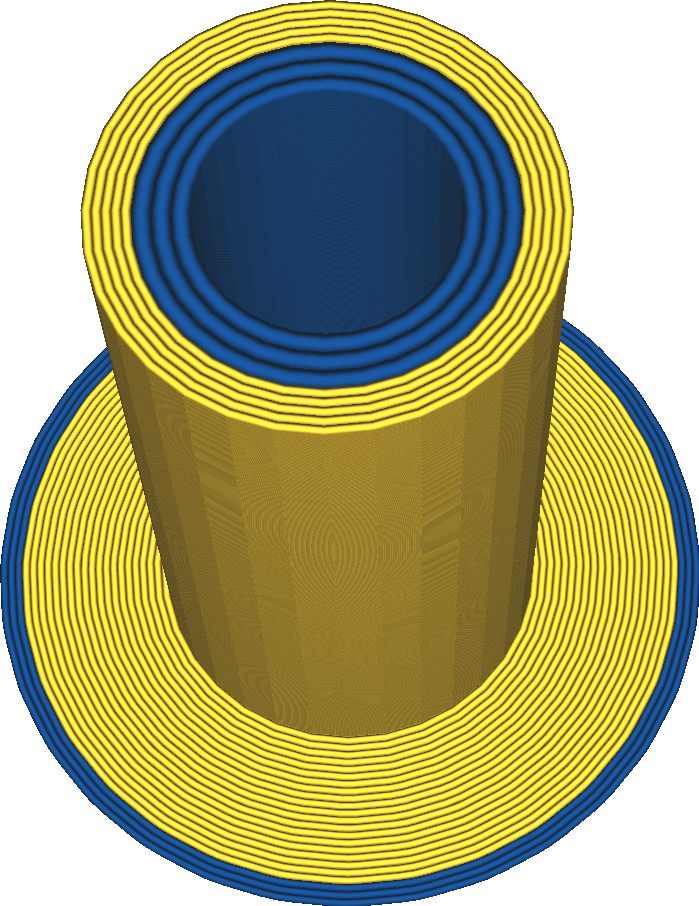

Linienbreite Einzugsturm
====
Diese Einstellung bestimmt die Breite der Linien, mit denen der Einzugsturm gedruckt wird.

<!--screenshot {
"image_path": "prime_tower_line_width.png",
"models": [
    {"script": "cube.scad"},
    {
        "script": "cube.scad",
        "object_settings": {"extruder_nr": 1},
        "transformation": ["translateX(40)"]
    }
],
"camera_position": [475, -419, 131],
"camera_lookat": [475, -465, 20],
"settings": {
    "prime_tower_enable": true,
    "[1]prime_tower_line_width": 0.8
},
"colour_scheme": "material_colour",
"colours": 64
}-->

Die Wahl einer dickeren Linienbreite führt manchmal dazu, dass der Einzugsturm schneller gedruckt wird. Wenn das Volumen, das durch eine Kontur extrudiert wird, ausreichend groß ist, macht eine Erhöhung der Linienbreite eine weitere Runde überflüssig. Wird die Linienbreite jedoch zu stark erhöht, kann der Einzugsturm schwächer werden, da nicht genügend Material schnell genug extrudiert werden kann.