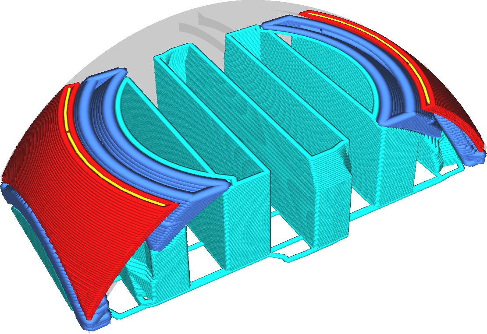

Breite der Stützdachlinie
====
Die breite der Stützlinien des Daches kann getrennt von der Breite der übrigen Stützstruckturlinien konfiguriert werden.

<!--screenshot {
"image_path": "support_roof_line_width.png",
"models": [
    {
        "script": "trash_bin_lid.scad",
        "transformation": ["scale(0.5)"]
    }
],
"camera_position": [-47, 79, 110],
"settings": {
    "support_enable": true,
    "support_roof_enable": true,
    "support_roof_line_width": 0.8
},
"layer": 192,
"colours": 64
}-->

Das Drucken des Stützdaches mit etwas dünneren Linien ist oft vorteilhaft für die Qualität der überhängenden Oberfläche, die es stützt, da die Oberfläche über der Stützstrukturschnittstelle glatter ist. Allerdings wird dadurch nicht unbedingt die Haftung zwischen der Stützstrukturfläche und dem Modell erhöht, so dass die Stützstrukturfläche nicht unbedingt schwerer zu entfernen ist.

Wenn die Dachlinien jedoch zu dünn gedruckt werden, führt dies zu einer ungleichmäßigen Extrusion, wodurch die Stützwirkung des Daches verringert und die Qualität des Überhangs verschlechtert wird. Außerdem kann es zu einer starken Veränderung der Durchflussrate durch die Düse kommen, was zu einer Überextrusion führt, wenn mit dem Druck des Stützdaches begonnen wird, und zu einer Unterextrusion, wenn das, was nach dem Stützdach kommt, gedruckt wird.