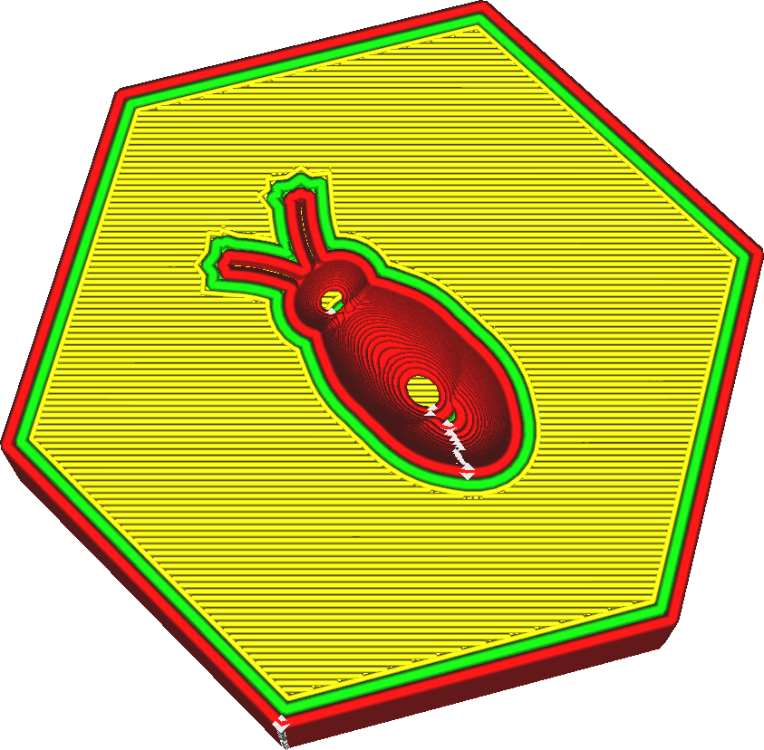

Breite der Wandlinien
====
Die Breite der Wandlinien kann getrennt vom Rest des Drucks eingestellt werden. Diese Einstellung gibt an, wie breit die einzelnen Wandlinien sein werden.

<!--screenshot {
"image_path": "wall_line_width.png",
"models": [{"script": "hive.scad"}],
"camera_position": [-31, -31, 147],
"settings": {
    "wall_line_count": 2,
    "wall_line_width": 0.8
},
"colours": 64
}-->

Die Reduzierung der Wandlinienbreite, ein klein wenig unterhalb der Düsengröße, ist bekanntermaßen vorteilhaft für die Festigkeit. Die Düse wird etwas weniger Material extrudieren, aber ihre Öffnung wird sich mit den angrenzenden Wandlinien überlappen. Dies führt dazu, dass das Material von der zuvor platzierten Wand an die gewünschte Stelle gedrückt wird. Das führt aber auch dazu, dass der Kunststoff besser mit den angrenzenden Wänden verschmilzt. Dadurch können die Wände besser miteinander verschmelzen, so dass sie ihre Stärke verbinden können. Dadurch wird die Festigkeit der Wände erheblich verbessert.

Durch die Verkleinerung der Wandlinienbreite kann die Düse auch feinere Details drucken. Insbesondere die [Breite der äußeren Wandlinien](wall_line_width_0.md) ist für diese Eigenschaft wichtig.

Eine Erhöhung der Wandlinienbreite kann die Druckzeit verkürzen. Sie benötigen dann weniger Wandlinien, um Teile mit ähnlicher Festigkeit zu erhalten. Die Festigkeit wird dennoch etwas reduziert, da benachbarte Wände nicht so stark miteinander verschmelzen.

Linien passend machen
----
Beim Drucken von dünnen Objekten ist die Anpassung der Wandlinienbreite ein wichtiges Werkzeug, um genaue und stabile Modelle zu erhalten. Cura zeichnet immer nur vollständige Konturen, wenn also eine Kontur nicht passt, entsteht eine Lücke in den Wänden, was die Festigkeit und Genauigkeit des Objekts stark beeinträchtigt.

Cura wird versuchen, solche Lücken zwischen den Wänden zu füllen, wenn [Lücken zwischen Wänden füllen](../shell/fill_perimeter_gaps.md) aktiviert ist, aber diese Technik ist nicht ideal für jede beliebige Form und benötigt oft viel Druckzeit. Wenn sich zwei Wände überlappen, reduziert die Funktion [Wandüberlappungen ausgleichen](../shell/travel_compensate_overlapping_walls_enabled.md) die Breite der Wandlinien, um sicherzustellen, dass das Bauteil maßhaltig ist, was jedoch Veränderungen des Flusses zur Folge hat, die ebenfalls die Qualität und Festigkeit des Drucks verringern.

Für eine ideale Passform sollte das Bauteil ein exaktes Vielfaches der Wandlinienbreite haben, damit die Wände genau in das Bauteil passen. Wenn Sie wissen, wie breit Ihr Bauteil ist, lässt sich dies durch Anpassen der Wandbreite leicht bewerkstelligen. Zuerst sehen Sie, wie viele Konturen Sie einpassen wollen, damit die Linien noch eine vernünftige Breite haben. Dann können Sie feststellen, wie stark Sie die Breite der Wandlinien anpassen müssen, damit die Linien richtig passen. Denken Sie daran, dass Sie die [Breite der äußeren Wandlinien] (wall_line_width_0.md) und die [Breite der inneren Wandlinien] (wall_line_width_x.md) separat einstellen können. Zählen Sie sorgfältig, wie oft jede Art von Wand gezeichnet wird, um die Auswirkungen einer Änderung der Wandlinienbreite vorherzusagen.

Das Anpassen von Wandlinien ist eine wichtige Fähigkeit beim 3D-Druck, die erfahrene 3D-Druckeranwender von anderen unterscheidet. Es bedarf etwas Übung.