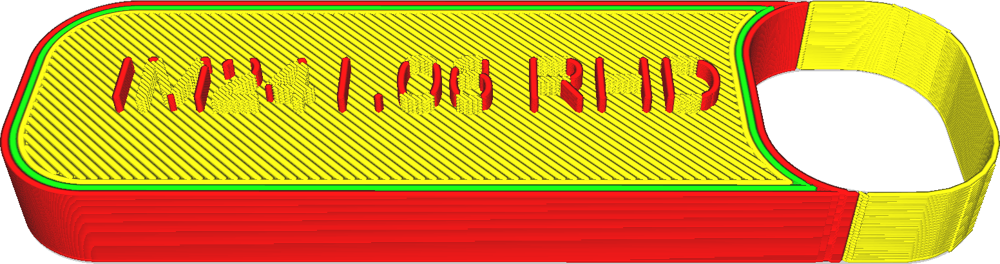

Drucken von dünnen Wänden
====
Normalerweise lässt Cura Wände, die dünner als die [Breite der äußeren Wandlinien](../resolution/wall_line_width_0.md) sind, aus und verwirft sie als zu klein zum Drucken.

Wenn diese Einstellung aktiviert ist, wird Cura trotzdem versuchen, diese Teile zu drucken. Der resultierende Druck wird ungenau und unordentlich sein, allerdings sollte er die gewünschte Form einigermaßen zuverlässig erzeugen.

<!--screenshot {
"image_path": "fill_outline_gaps_disabled.png",
"models": [{"script": "label.scad"}],
"camera_position": [0, 30, 80],
"settings": {"fill_outline_gaps": false},
"colours": 64
}-->
<!--screenshot {
"image_path": "fill_outline_gaps_enabled.png",
"models": [{"script": "label.scad"}],
"camera_position": [0, 30, 80],
"settings": {"fill_outline_gaps": true},
"colours": 64
}-->

Die winzigen Stücke werden mit extrem dünnen Linien gefüllt. Diese Linien werden dann kombiniert, wenn sie nebeneinander liegen und nicht zu lang sind. Das funktioniert in vielen Fällen, aber in manchen Fällen entsteht ein winziges Zickzack, was die Druckzeit erheblich verlängert.

Bevor Sie auf diese Einstellung zurückgreifen, sollten Sie versuchen, die Breite der Außenwandlinien etwas anzupassen. Wenn Ihr Teil etwas dünner als eine Linienbreite ist, kann es zu einem besseren Ergebnis führen, wenn Sie die Außenwandlinienbreite des gesamten Drucks so reduzieren, dass die dünnen Teile normal gedruckt werden. Wenn Sie die Linienbreite jedoch zu weit reduzieren, fließt das Material unzuverlässig, was zu Unterextrusion führt.

**Damit wird nur versucht, Teile zu drucken, die in der horizontalen Ebene dünn sind. Für dünne Teile in Z-Richtung sehen Sie sich die Einstellung [Slicing-Toleranz](../experimental/slicing_tolerance.md) an oder erhöhen Sie die Schichthöhe.**