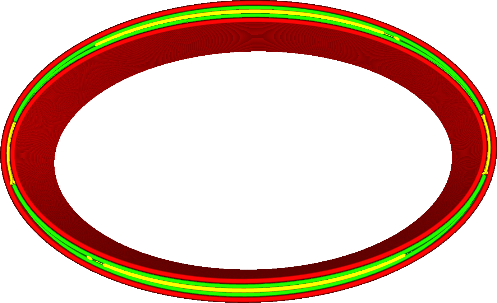

Lücken zwischen Wänden füllen
====
Viele Drucke enthalten Teile, die dünner sind als die gewünschte Wandstärke. In den meisten Fällen ist das in Ordnung, aber bei einigen Drucken würde dies eine Lücke zwischen den Wänden hinterlassen. Wenn diese Einstellung aktiviert ist, werden die Lücken zwischen den Wänden mit einem Klecks zusätzlichen Materials aufgefüllt.

<!--screenshot {
"image_path": "fill_perimeter_gaps_disabled.png",
"models": [{"script": "spherical_cap.scad"}],
"camera_position": [0, 0, 117],
"settings": {
    "wall_line_count": 3,
    "fill_perimeter_gaps": "nowhere"
},
"colours": 64
}-->
<!--screenshot {
"image_path": "fill_perimeter_gaps_enabled.png",
"models": [{"script": "spherical_cap.scad"}],
"camera_position": [0, 0, 117],
"settings": {
    "wall_line_count": 3,
    "fill_perimeter_gaps": "everywhere"
},
"colours": 64
}-->

Es gibt zwei häufige Fälle, in denen das Auffüllen von Lücken sinnvoll ist:
* Zwischen zwei gegenüberliegenden Wänden in dünnen Drucken (wie in den Abbildungen oben). Das Füllen dieser Lücken erhöht die Festigkeit des Teils an diesen Stellen, da sich die beiden gegenüberliegenden Wände nicht mehr getrennt voneinander bewegen können.
* In sehr scharfen Ecken gibt es eine Lücke in der Außenwand, wo die Innenwand zu dick ist, um bis in die Ecke zu reichen. Das Füllen dieser Lücken erhöht die Festigkeit, lässt aber auch die Außenwand gleichmäßiger aussehen.

**Es ist ratsam, gut darauf zu achten, welche Fahrwege notwendig sind, wenn dies aktiviert ist. Das Füllen der Lücken erfolgt, nachdem die Wände fertig gedruckt sind.**