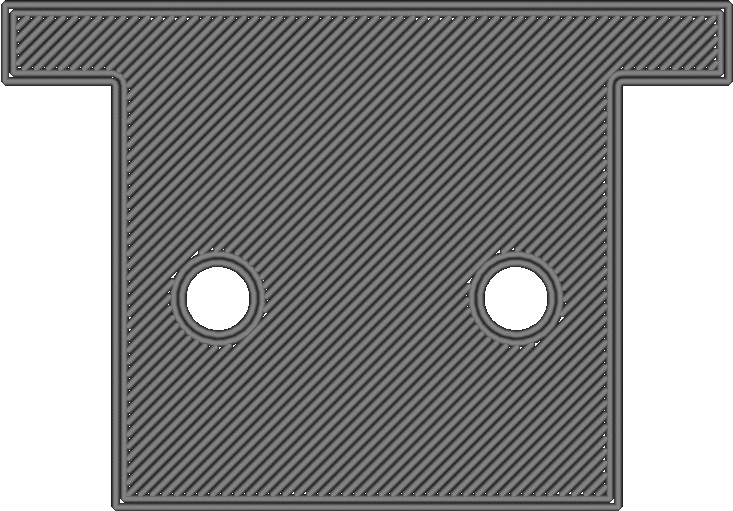

Wandreihenfolge
====
Diese Einstellung legt fest, welche Wände zuerst gedruckt werden: von außen nach innen oder von innen nach außen.

<!--screenshot {
"image_path": "outer_inset_first_disabled.gif",
"models": [{"script": "calendar_holder.scad"}],
"camera_position": [0, 0, 120],
"settings": {
    "skin_outline_count": 0,
    "inset_direction": "inside_out"
},
"layer": 2,
"line": [0, 6, 12, 18, 25, 35, 41, 47, 54, 57, 61, 64, 65, 68, 72, 74, 77, 79, 80, 82, 86, 96, 102, 108, 114, 125, 131, 137, 144],
"delay": 125,
"colours": 32
}-->
<!--screenshot {
"image_path": "outer_inset_first_enabled.gif",
"models": [{"script": "calendar_holder.scad"}],
"camera_position": [0, 0, 120],
"settings": {
    "skin_outline_count": 0,
    "inset_direction": "outside_in"
},
"layer": 2,
"line": [0, 6, 12, 18, 25, 35, 41, 47, 54, 58, 61, 63, 64, 66, 70, 72, 76, 79, 80, 83, 88, 97, 103, 109, 116, 125, 131, 137, 144],
"delay": 125,
"colours": 32
}-->

Diese Einstellung hat einen geringen Einfluss auf die Qualität und die Maßgenauigkeit:
* Wenn Sie von außen nach innen drucken, verbessert sich die Maßgenauigkeit. Benachbarte Wände schieben sich in der Regel gegenseitig ein wenig, besonders wenn die Wandlinienbreite kleiner als die Düsengröße ist. Die Wand, die zuerst gedruckt wird, ist bereits verfestigt und wird nicht mehr so stark verdrängt. Wenn Sie also die äußere Wand zuerst drucken, wird die äußere Wand genauer positioniert.
* Wenn die Füllung vor den Wänden gedruckt wird, wird das Durchscheinen der Füllung auf der Oberfläche durch das Drucken von außen nach innen reduziert. Andernfalls wird zuerst die Füllung gedruckt, dann die Innenwände, die durch die Füllung nach außen gedrückt werden, und dann die Außenwand, die durch die Innenwände nach außen gedrückt wird. Infolgedessen könnte auf der Außenseite ein Muster sichtbar sein. Wenn die Außenwand zuerst gedruckt wird, kann die Außenwand erstarren, bevor die Innenwand auf sie drücken kann.
* Von innen nach außen zu drucken ist besser für den Überhang. Die Außenwand ist weiter von der vorherigen Schicht entfernt als die Innenwand. Wenn die Außenwand zuerst gedruckt wird, hat die Außenwand noch nichts, woran sie sich festhalten kann. Wenn die Innenwand zuerst gedruckt wird, kann die Außenwand seitlich an der Außenwand anliegen.