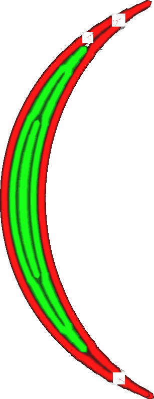
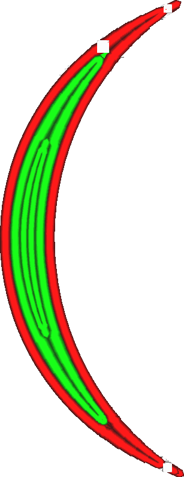

Minimale Wandlinienstärke (geradzahlig)
====
Wenn Sie dünne Teile drucken, passt Cura die Breite der Wandlinien an die exakte Breite des Modells an. Cura kann auch entscheiden, stattdessen weniger Wandlinien zu verwenden. Diese Einstellung ist der Schwellenwert, bei dem Cura zwei Linien zu einer zusammenfasst. Sie kann getrennt von der [Schwelle, bei der die mittlere Linie entfernt wird](min_odd_wall_line_width.md) eingestellt werden.

<!--screenshot {
"image_path": "min_wall_line_width_0_34.png",
"models": [{"script": "moon_sickle.scad"}],
"camera_position": [0, 0, 63],
"settings": {
	"min_wall_line_width": 0.34,
	"wall_line_count": 3,
	"wall_transition_angle": 20
},
"layer": 14,
"colours": 32
}-->
<!--screenshot {
"image_path": "min_wall_line_width_even_0_1.png",
"models": [{"script": "moon_sickle.scad"}],
"camera_position": [0, 0, 63],
"settings": {
	"min_even_wall_line_width": 0.1,
	"min_wall_line_width": 0.34,
	"wall_line_count": 3,
	"wall_transition_angle": 20
},
"layer": 14,
"colours": 32
}-->

Gerade vs. Ungerade Linien
----
Mit dieser Einstellung kann der Schwellenwert für das Entfernen von Linien speziell bei einer geraden Anzahl von Linien angepasst werden. Dies ist der Fall, wenn sich in der Mitte zwei Linien befinden und nicht nur eine einzige Linie. Sie bestimmt, wann sich diese beiden Linien in der Mitte zu einer einzigen Linie verbinden.

Die Mindestbreite der geraden Wandlinien kann sich von der Mindestbreite der ungeraden Wandlinien unterscheiden, und zwar aufgrund der Art und Weise, wie sie miteinander verbunden werden. Die geraden Linien verbinden sich an ihren Enden, indem die Enden näher zusammenrücken. Dort überschneiden sich diese Linien, was zu einer Überschneidung führt. Dies ist anders als bei einer ungeraden Anzahl von Wänden: Die Linie in der Mitte hört dann einfach auf und hinterlässt eine Lücke im Druck. Eine Verringerung der Mindestbreite der geraden Wandlinien reduziert die Überextrusion an den Übergängen von geraden zu ungeraden Linien. Eine Verringerung der Mindestbreite der ungeraden Wandlinien verringert die Größe der Lücke an den Übergängen von ungeraden zu geraden Linien.

Die Lücken, die am Ende einer ungeraden Linie zurückbleiben, sind im Endergebnis sichtbarer als eine leichte Überextrusion an einer Nahtstelle, so dass es hilfreich sein kann, die Mindestbreite der geraden Wandlinien etwas höher einzustellen als die Mindestbreite der ungeraden Wandlinien.

Eine Verringerung dieser Einstellung führt zu:
* Verringerung des Überlappungsbereichs, in dem zwei Linien zu einer Linie verschmelzen.
* Reduzierte maximale Breite von einzelnen Mittellinien.
* Dünnere Linien, die sich möglicherweise nicht gut extrudieren lassen.
* Mehr Linien, die länger zum Drucken brauchen.

**Diese Einstellung gilt nicht nur für normale Wände, sondern auch für Wände mit zusätzlicher Außenhaut, Support-Wände, Füllungen und konzentrische Muster.**