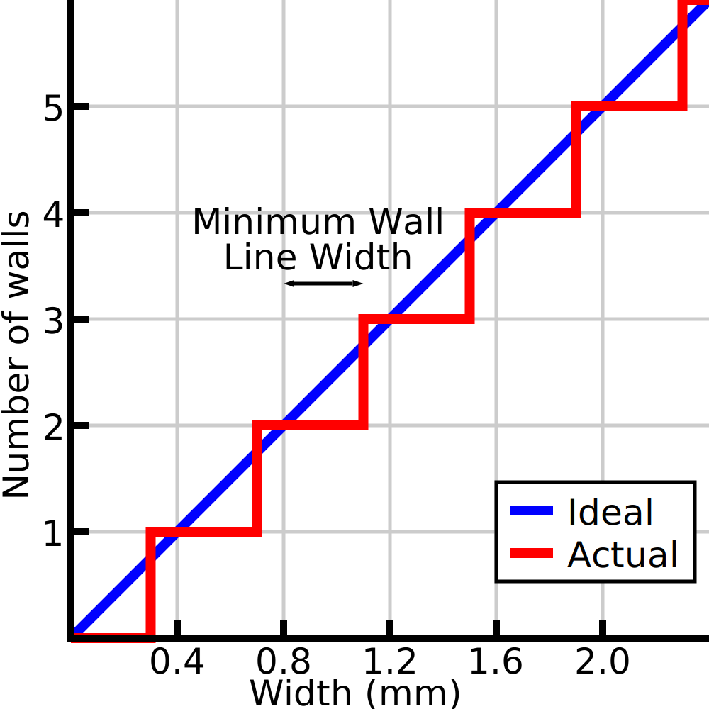

Mindestlinienstärke der Wand
====
Wenn Sie dünne Teile drucken, passt Cura die Breite der Wandlinien an die exakte Breite des Modells an. Cura kann auch entscheiden, stattdessen weniger Wandlinien zu verwenden. Diese Einstellung bestimmt den Schwellenwert, bei dem Cura entscheidet, eine Wand zu entfernen, anstatt die vorhandenen Wände dünner zu machen.

<!--screenshot {
"image_path": "min_wall_line_width_0_34.png",
"models": [{"script": "moon_sickle.scad"}],
"camera_position": [0, 0, 63],
"settings": {
	"min_wall_line_width": 0.34,
	"wall_line_count": 3,
	"wall_transition_angle": 20
},
"layer": 14,
"colours": 32
}-->
<!--screenshot {
"image_path": "min_wall_line_width_0_1.png",
"models": [{"script": "moon_sickle.scad"}],
"camera_position": [0, 0, 63],
"settings": {
	"min_wall_line_width": 0.1,
	"wall_line_count": 3,
	"wall_transition_angle": 20
},
"layer": 14,
"colours": 32
}-->

Unterschiedliche Anzahl von Wänden
----
Wenn es nur eine einzige zentrale Linie gibt und die [Anzahl verteilter Wände](wall_distribution_count.md) auf 1 gesetzt ist, funktioniert diese Einstellung genau so, wie gesagt. Wenn die Linie in der Mitte dünner als eine bestimmte Breite wird, wird sie entfernt, um andere Linien breiter zu machen. In anderen Fällen ist die Berechnung etwas komplexer.

Die genaue Berechnung ist komplex, aber ein intuitives Verständnis kann hilfreich sein. Im Grunde können Sie einfach die Gesamtbreite des Modells durch die [normale Linienbreite](../resolution/wall_line_width.md) dividieren , um eine bestimmte Anzahl von Wänden zu erhalten. Dies kann auch ein Bruchteil sein (z. B. 5,3 Wandlinienbreiten). Die minimale Wandlinienbreite nimmt nur diesen Bruchteil (0,3 Linienbreiten) und fügt eine zusätzliche Wand hinzu, wenn sie die minimale Wandlinienbreite überschreitet. Wenn die Anzahl der Wände bekannt ist, wird die Breite der einzelnen Linien entsprechend der Wandverteilungszahl bestimmt.

Das bedeutet, dass die Linienbreite bei mehreren Linien, deren Breite angepasst wird, nie so extrem sein wird, wie es die Mindestwandlinienbreite erlauben würde. Wenn z. B. die beiden mittleren Linien angepasst werden, wird die Linienbreite nicht unter den Durchschnitt der normalen Linienbreite und der Mindestwandlinienbreite fallen.

Die Einstellung kann separat für [gerade](min_even_wall_line_width.md) und [ungerade](min_odd_wall_line_width.md) Anzahl der Wände angepasst werden. Die Anzahl von 0 Wänden ist ebenfalls ein separater Fall, der mit der Einstellung [Mindestgröße des Merkmals](min_feature_size.md) angepasst werden kann.

Einstellung
----
Theoretisch gewährleistet eine Einstellung von 50 % der Linienbreite, dass die Linienbreite der normalen Linienbreite am nächsten kommt. Es ist jedoch besser, ein wenig darüber zu liegen. Es ist für einen Drucker einfacher, Linien zu drucken, die breiter als die Düsengröße sind, als dünnere Linien zu drucken, und weniger Linien zu haben bedeutet auch, dass der Druck schneller ist.

Bei sehr zähflüssigen Materialien oder wenn schneller gedruckt wird, sollte die Mindestwandlinienbreite verringert werden, um zu breite Linien zu vermeiden. Diese sind schwer zu drucken, wenn das Material nicht genügend Zeit hat, zu den Seiten zu fließen. Ist die minimale Wandlinienbreite zu hoch, haften die Wände nicht gut aneinander, wodurch der Druck brüchig wird.

**Diese Einstellung gilt nicht nur für normale Wände, sondern auch für Wände mit zusätzlicher Außenhaut, Support-Wände, Füllungen und konzentrische Muster.**