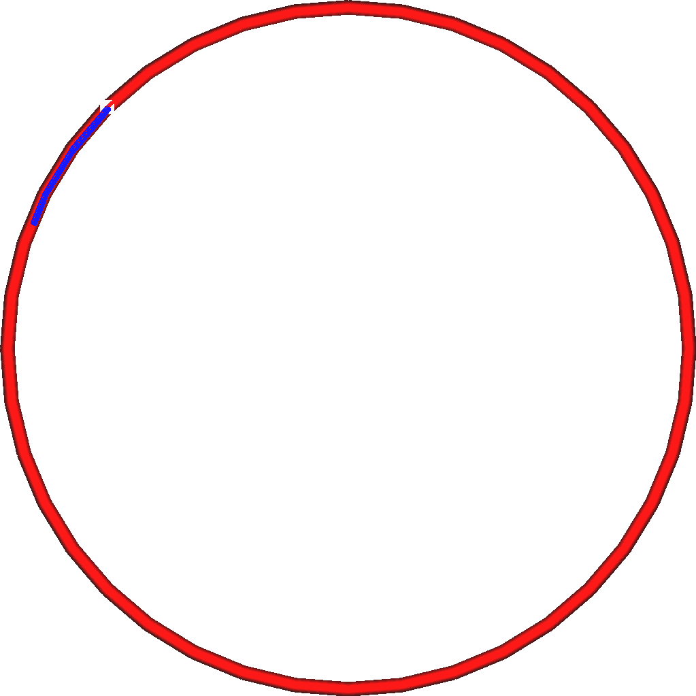

Wipe-Abstand der Außenwand
====
Bei dieser Einstellung fährt die Düse am Ende jeder Außenwand etwas weiter, ohne zu extrudieren, und schließt die Kontur ab.

<!--screenshot {
"image_path": "wall_0_wipe_dist.png",
"models": [
    {
        "script": "thin_cylinder.scad",
        "transformation": ["scale(0.5)"]
    }
],
"camera_position": [0, 0, 50],
"settings": {
    "wall_0_wipe_dist": 4
},
"structures": ["travels", "helpers", "shell", "infill", "starts"],
"minimum_layer": 2,
"layer": 2,
"colours": 16
}-->

Das Ziel dieser Funktion ist es, die Sichtbarkeit der Naht zu verringern. Wenn die Wand fertiggestellt ist, befindet sich normalerweise immer noch ein Tropfen unterhalb der Düse. Dieser kleine Fahrweg verbindet diesen Tropfen mit dem Beginn der Kontur, so dass die Naht geschlossen wird.

Die Naht ist zwar immer noch sichtbar, aber das Ergebnis sollte mit einem kleinen Wipe-Abstand etwas besser sein. Eine zu starke Erhöhung dieser Einstellung hat keine Wirkung mehr, da die Düse über die Naht hinausfährt, was später zu einer Unterextrusion führen kann, da sich die Düsenkammer durch Oozing an der Außenwand leert.

Dieser Effekt ist im Grunde das Gegenteil von [coasting](../experimental/coasting_enable.md), das das Extrudieren kurz vor dem Ende der Kontur beendet.