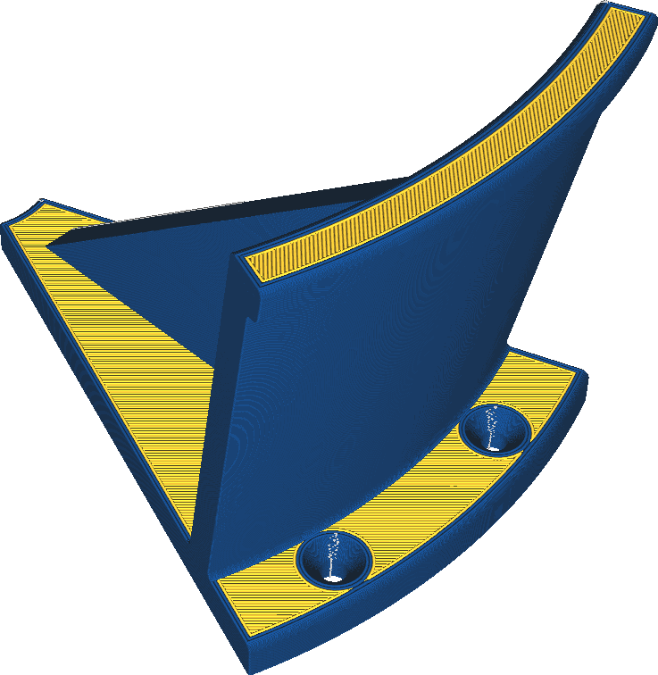

Extruder für Wand
====
Wenn Ihr Drucker mit mehreren Extrudern ausgestattet ist, können Sie auch nur die Wände mit einem anderen Extruder drucken.

<!--screenshot {
"image_path": "wall_extruder_nr.png",
"models": [{"script": "headphone_hook.scad"}],
"camera_position": [140, 140, 206],
"settings": {"wall_extruder_nr": 1},
"colour_scheme": "material_colour",
"colours": 32
}-->

Das Drucken der Wände mit einem anderen Extruder kann verschiedene Zwecke erfüllen:
* Nur ein optischer Effekt durch Drucken der Außenwand in einer anderen Farbe.
* Die Wände können mit einem Material gedruckt werden, das bessere Details erzielt, aber unerwünschte Festigkeitseigenschaften für die Füllung aufweist.
* Die Wände können mit einem flexiblen Material gedruckt werden, um eine weichere Textur auf dem Druck zu erhalten und mehr Reibung/Griffigkeit zu erzielen.
* Die Wände können aus einem Material mit einem geringeren Reibungskoeffizienten gedruckt werden, damit bewegliche Teile leichter über die Oberfläche gleiten können.