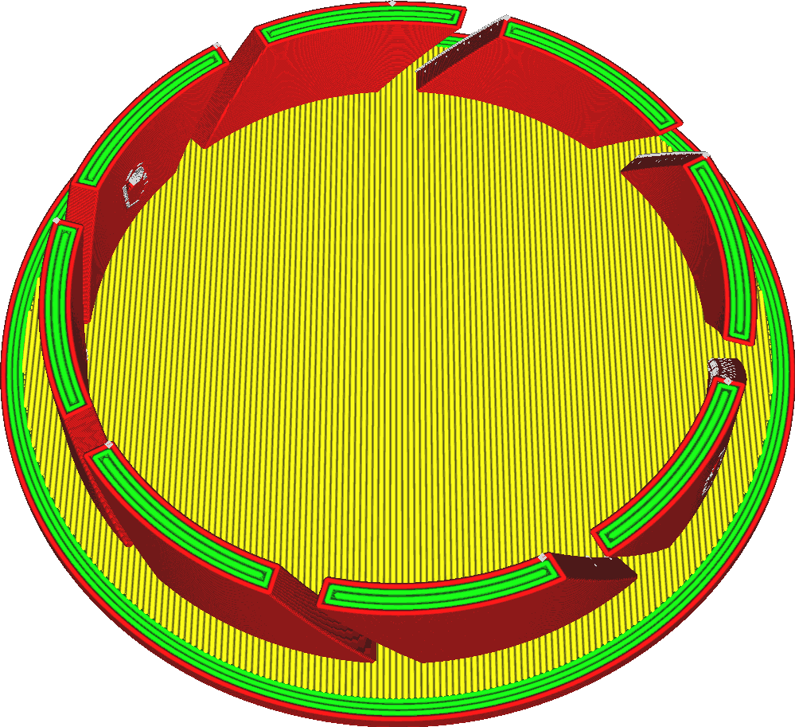

Wanddicke
====
Diese Einstellung bestimmt, wie dick die Wand um den Druck herum sein wird. Letztendlich wird die Anzahl der Innenwände angepasst, um die gewünschte Dicke zu erreichen.

<!--screenshot {
"image_path": "wall_thickness_0.8.png",
"models": [
    {
        "script": "rotary_tumbler_lid.scad",
        "transformation": ["scale(0.4)"]
    }
],
"camera_position": [50, 50, 124],
"settings": {
    "skin_outline_count": 0,
    "wall_line_count": 2
},
"colours": 32
}-->
<!--screenshot {
"image_path": "wall_thickness_1.6.png",
"models": [
    {
        "script": "rotary_tumbler_lid.scad",
        "transformation": ["scale(0.4)"]
    }
],
"camera_position": [50, 50, 124],
"settings": {
    "skin_outline_count": 0,
    "wall_line_count": 4
},
"colours": 32
}-->

Die Wandstärke muss ein Vielfaches der Wandlinienbreite sein. Ist dies nicht der Fall, wird sie auf ein exaktes Vielfaches gerundet. Beachten Sie jedoch, dass eine der Wände eine Außenwand und die übrigen Wände Innenwände sein werden. Diese Wände können unterschiedliche Linienbreiten haben.

Die Dicke der Wände ist ein wichtiger Faktor dafür, wie stark der Druck sein wird. Da die Wände nebeneinander liegen, können sie sich gegenseitig verstärken, was zu einem stärkeren Teil führt. Bei größeren Drucken kann dies ein viel effektiverer Weg sein, um ein starkes Objekt zu erhalten, als die Füllung je nach Form anzupassen.

Eine Erhöhung der Wanddicke wird:
* Die Festigkeit des Drucks wird deutlich erhöht.
* Verringerung des Durchscheineffekts an den Stellen, an denen das Füllmuster von außen sichtbar ist.
* Verbesserung der Überhänge, da die Wandlinien in der Regel stärker auf den nächstgelegenen Auflagerpunkt ausgerichtet sind.
* Das Modell leichter wasserdicht machen.
* Deutliche Erhöhung der Druckzeit und des Materialverbrauchs des Drucks.