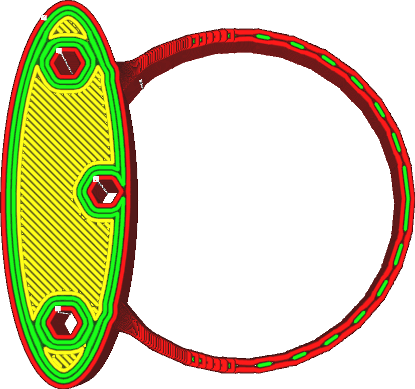
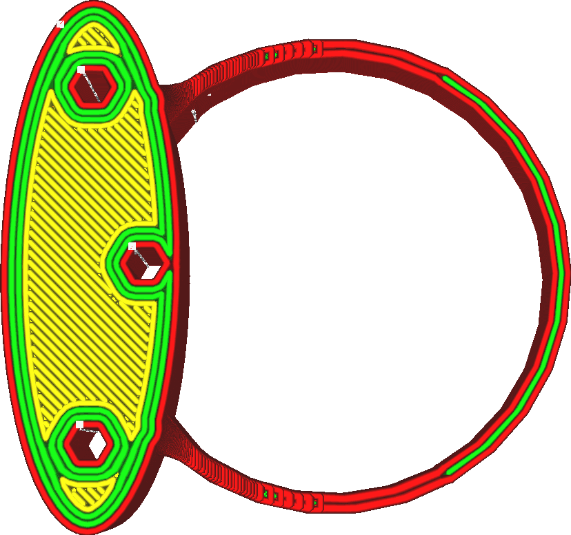

Wandübergangsfilter Abstand
====
Einige Modelle haben dünne Elemente, die um die Schwelle liegen, an der unterschiedlich viele Wände verwendet werden. Dies kann dazu führen, dass die Anzahl der Wände hin und her wechselt, auch wenn die tatsächliche Breite des Stücks nicht viel variiert. Dieser Wechsel beeinträchtigt die Druckqualität, da viele Änderungen des Flusses erforderlich sind und mehr Fahrbewegungen hinzugefügt werden müssen. Mit dieser Funktion werden Übergänge entfernt, wenn sie innerhalb einer bestimmten Entfernung hin und her gegangen wären.

<!--screenshot {
"image_path": "wall_transition_filter_off.png",
"models": [{"script": "signet.scad"}],
"camera_position": [0, 11, 106],
"settings": {
	"wall_transition_filter_distance": 0,
	"wall_transition_filter_margin": 0,
	"wall_line_count": 3
},
"colours": 64
}-->
<!--screenshot {
"image_path": "wall_transition_filter_on.png",
"models": [{"script": "signet.scad"}],
"camera_position": [0, 11, 106],
"settings": {
	"wall_transition_filter_distance": 100,
	"wall_transition_filter_margin": 0.2,
	"wall_line_count": 3
},
"colours": 64
}-->

Wenn ein Übergang entfernt wird, können einige der Linien vorübergehend zu breit oder zu dünn werden und so die [Mindestlinienstärke der Wand](min_wall_line_width.md) überschreiten. Schließlich war dort ein Übergang vorhanden, der sich besser an die Breite des Teils anpasst. Ohne diesen Übergang wird es eine geringere oder höhere Anzahl von Wänden verwenden, als ideal wäre, und die Breite dieser Wände wird entsprechend angepasst. Dies ist bis zum [Rand des Wandübergangsfilter](wall_transition_filter_deviation.md) zulässig. Wenn die Breite der Wände zu stark variiert, wird der Übergang nicht entfernt.

Dieser Filter zielt darauf ab, ein häufiges Problem bei dünnen Teilen mit niedrig aufgelösten 3D-Netzen zu lösen. Das 3D-Modell, das aus flachen Dreiecken besteht, kann eine Kurve nicht exakt darstellen, sondern nur annähern. Die Kurve wird Kanten haben, zwischen denen flache Flächen liegen. Bei der Modellierung eines gekrümmten Teils mit einer konstanten Breite ist es wichtig, dass die Außenkanten mit den Innenkanten übereinstimmen. Wenn dies nicht der Fall ist, variiert die Breite des Kreisrings leicht, was zu dem oben gezeigten Effekt führen kann. Wenn dies der Fall ist, sollte der Übergangsfilter verhindern, dass der Effekt zu stark ausfällt.

Eine Vergrößerung des Abstands verhindert, dass in manchen Fällen kleine Liniensegmente entstehen. Dadurch lässt sich schneller drucken und die Oberfläche kann glatter aussehen. Es führt jedoch auch dazu, dass ein größerer Teil des Drucks extreme Linienbreiten aufweist, die sich möglicherweise nicht gut aus der Düse extrudieren lassen. Wenn Sie Modelle mit niedriger Auflösung und dünnen Teilen drucken, kann eine Vergrößerung des Abstands die Qualität verbessern. Bei schwierigen Materialien ist es besser, auf der sicheren Seite zu bleiben.

**Diese Einstellung ist derzeit für den Benutzer nicht sichtbar. Der Filter kann nur über den [Wandübergangsfilter Rand](wall_transition_filter_deviation.md) angepasst werden. Er wirkt sich nicht nur auf die normalen Wände aus, sondern auch auf Wände mit zusätzlicher Außenhaut, Support-Wände, Füllungen und konzentrische Muster.**