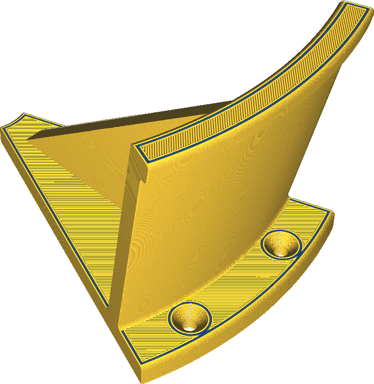

Extruder Innenwand
====
Wenn Ihr Drucker über mehrere Extruder verfügt, können Sie auch nur die Innenwände mit einem anderen Extruder drucken.

<!--screenshot {
"image_path": "wall_x_extruder_nr.png",
"models": [{"script": "headphone_hook.scad"}],
"camera_position": [140, 140, 206],
"settings": {"wall_x_extruder_nr": 1},
"colour_scheme": "material_colour",
"colours": 32
}-->

Es ist ratsam, die Innenwände mit demselben Extruder zu drucken wie die Füllung, die Außenhaut oder die Außenwände. Es gibt keinen wirklichen Grund, die Innenwände mit einem anderen Extruder als den Rest zu drucken, außer vielleicht für einen interessanten optischen Effekt. Die Farbe der Innenwand neigt dazu, die Außenwand leicht durchscheinen zu lassen.

Wenn die Innenwände mit demselben Extruder wie die Füllung, die Außenhaut oder die Außenwand gedruckt werden, können sie sich besser mit diesen Strukturen verbinden. So entsteht ein stabileres Teil. Denken Sie bei der Einstellung des Extruders für diese anderen Strukturen daran, woran Sie die Innenwände binden möchten.