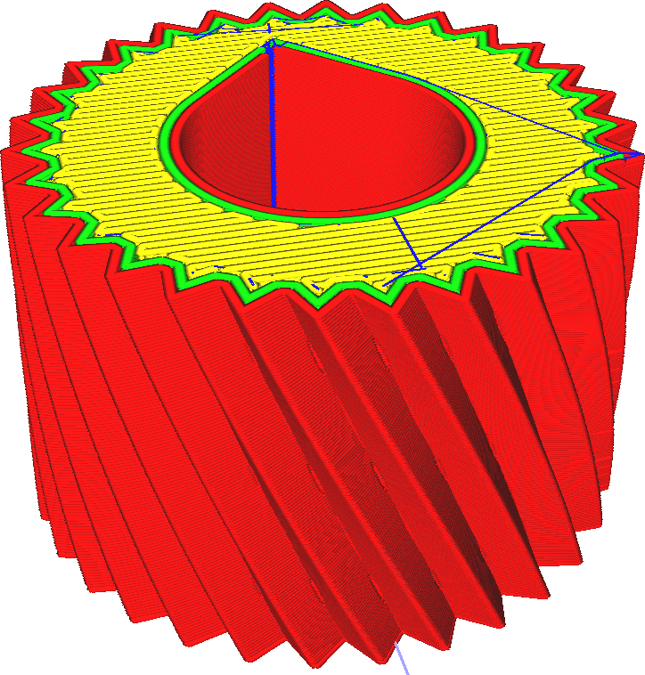

Justierung der Z-Naht
====
Mit dieser Einstellung können Sie festlegen, wo die Naht jeder Kontur platziert werden soll. Es stehen mehrere Optionen zur Verfügung, mit denen Sie die Platzierung der Naht genau steuern können, um ihre Auswirkungen zu minimieren oder die Naht bei der Nachbearbeitung leichter entfernen zu können.

Die Naht ist der Punkt, an dem der Druck der Kontur beginnt und endet. Selbst wenn der Weg der Düse ein geschlossener Kreis ist, da der Druckprozess nie ganz genau ist, bleibt eine Naht dort, wo die Extrusion beginnt und endet. Mit dieser Einstellung kann die Sichtbarkeit der Naht minimiert werden, indem sie irgendwo versteckt oder verteilt wird.
<!--screenshot {
"image_path": "z_seam_type_user.png",
"models": [{"script": "seams_on_curves.scad"}],
"camera_position": [51, -36, 132],
"settings": {
    "z_seam_corner": "z_seam_corner_outer",
    "z_seam_position": "left",
    "z_seam_type": "back"
},
"colours": 32
}-->
Benutzerdefiniert
----

Mit dieser Option können Sie eine Position manuell auswählen. Die Naht wird in der Ecke platziert, die der gewählten Position am nächsten ist. Dadurch liegen die Ecken in der Regel sehr dicht beieinander, so dass Sie die Naht leicht wegschneiden können. Zudem lässt sich die Position der Naht genau festlegen.

Standardmäßig wird eine Stelle auf der Rückseite des Druckers gewählt. Die Idee dahinter ist, dass die Benutzer die Vorderseite ihrer Modelle meist zur Vorderseite des Druckers zeigen lassen, so dass eine Position auf der Rückseite die Naht besser verdeckt.

<!--screenshot {
"image_path": "z_seam_type_shortest.png",
"models": [{"script": "seams_on_curves.scad"}],
"camera_position": [51, -36, 132],
"settings": {
    "z_seam_corner": "z_seam_corner_outer",
    "z_seam_type": "shortest"
},
"colours": 32
}-->
Kürzester
----

Bei dieser Option wird einfach die Länge der Fahrwege zur Naht minimiert, ohne dass die Naht an einer bestimmten Stelle platziert wird. Da der Fahrweg kürzer ist, spart man bei den Fahrwegen ein wenig Zeit. Die Naht wird auch etwas kleiner, weil weniger Ooze an der Stelle platziert wird, an der die Düse auf der Kontur landet.

Die gewünschte Ecke wird immer noch bevorzugt, indem eine Ecke in der Nähe der Düse gewählt wird. Es wird nicht die nächstgelegene Ecke gewählt, sondern es wird eine gewichtete Präferenz verwendet, um die Fahrwege etwas zu minimieren, aber auch eine geeignete Ecke für die Einstellung [Präferenz Nahtkante](z_seam_corner.md) zu verwenden.

<!--screenshot {
"image_path": "z_seam_type_random.png",
"models": [{"script": "seams_on_curves.scad"}],
"camera_position": [51, -36, 132],
"settings": {
    "z_seam_corner": "z_seam_corner_outer",
    "z_seam_type": "random"
},
"colours": 32
}-->
Zufall
----

Für die Naht wird eine zufällige Stelle um den Rand herum gewählt. Diese zufällige Stelle wird in jeder Schicht geändert, so dass die Naht ziemlich gleichmäßig über das Modell verteilt wird. Da die Nähte der verschiedenen Schichten nicht aufeinandertreffen, wird die Naht kaum sichtbar sein. Allerdings wird die Oberfläche insgesamt etwas unordentlicher aussehen.

<!--screenshot {
"image_path": "z_seam_type_sharpest.png",
"models": [{"script": "seams_on_curves.scad"}],
"camera_position": [51, -36, 132],
"settings": {
    "z_seam_corner": "z_seam_corner_outer",
    "z_seam_type": "sharpest_corner"
},
"colours": 32
}-->
Schärfste Kante
----

Die Naht wird in der schärfsten Kante der gesamten Kontur platziert, je nach der in der Einstellung [Präferenz Nahtkante](z_seam_corner.md) gewählten Kantenpräferenz. Dies kann zu längeren Fahrwegen führen, stellt aber sicher, dass die Naht je nach der für die Kanten eingestellten Präferenz maximal verdeckt oder freigelegt wird.