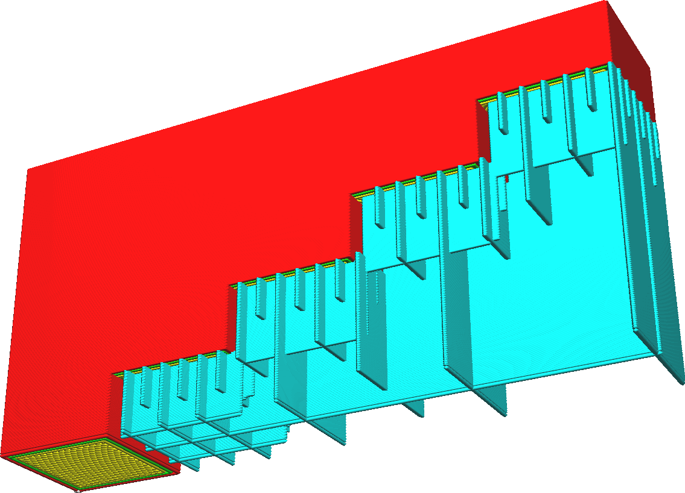

Höhe stufenweiser Füllungsschritt Stützstruktur
====
Bei dem stufenweisen Support wird die Dichte des Supports periodisch in mehreren Schritten von oben nach unten reduziert. Bei jedem Schritt wird die Support-Dichte halbiert. Diese Einstellung gibt die Höhe dieser Stufen an, also den Abstand zwischen zwei Stellen, an denen die Support-Dichte halbiert wird.

<!--screenshot {
"image_path": "gradual_support_infill_step_height_1mm.png",
"models": [
    {
        "script": "stair.scad",
        "transformation": ["rotateY(-90)", "scaleZ(0.5)"]
    }
],
"camera_position": [49, 91, -38],
"settings": {
    "support_enable": true,
    "support_pattern": "grid",
    "support_wall_count": 0,
    "support_infill_rate": 50,
    "gradual_support_infill_steps": 3,
    "gradual_support_infill_step_height": 1
},
"colours": 64
}-->
<!--screenshot {
"image_path": "gradual_support_infill_step_height_3mm.png",
"models": [
    {
        "script": "stair.scad",
        "transformation": ["rotateY(-90)", "scaleZ(0.5)"]
    }
],
"camera_position": [49, 91, -38],
"settings": {
    "support_enable": true,
    "support_pattern": "grid",
    "support_wall_count": 0,
    "support_infill_rate": 50,
    "gradual_support_infill_steps": 3,
    "gradual_support_infill_step_height": 3
},
"colours": 64
}-->

Beim schrittweisen Support wird naturgemäß ein Teil des Supports in die Luft gesetzt. Dies repariert sich jedoch normalerweise von selbst. Die erste Schicht des Supports wird in der Luft hängen und nur an den Seiten des Supports richtig anliegen. Die darüber liegenden Schichten können sich an den Enden ein wenig an der vorherigen Schicht abstützen, hängen aber in der Mitte durch. Dies wird von Schicht zu Schicht besser. Wenn die Höhe des schrittweisen Supports groß genug ist, ist der Support zum Zeitpunkt des nächsten Schrittes der Verdichtung richtig stabil.

Verringern Sie die Stufenhöhe der stufenweisen Füllung, um schnell auf eine niedrige Support-Dichte herunterzukommen. Dies spart Druckzeit und Materialverbrauch. Vergrößern Sie die Höhe der stufenweisen Füllung des Supports, wenn der Support bis zur nächsten Stufe der Support-Dichte nicht genug Platz hat, um sich selbst zu reparieren. Wenn Sie den Wert dieser Einstellung erhöhen, wird der Druck zuverlässiger.