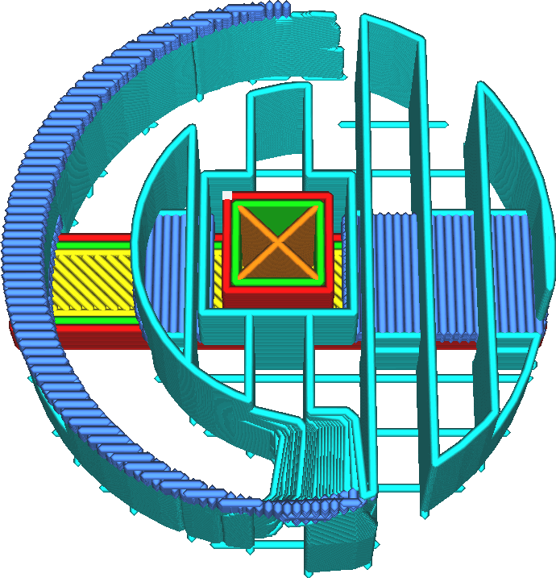

Richtungen der Bodenlinien unterstützen
====
Der Support-Boden ist normalerweise so ausgerichtet, dass er möglichst senkrecht zu dem darüber liegenden Support und dem darunter liegenden Modell steht. Wenn die Ausrichtung der Linien der oberen Oberfläche oder der Support-Linien angepasst wurde, ist es ratsam, auch die Ausrichtung der Linien des Support-Bodens anzupassen. Mit dieser Einstellung können Sie die Ausrichtung der Support-Bodenlinien anpassen.

<!--screenshot {
"image_path": "support_interface_angles_0.png",
"models": [
    {
        "script": "plug.scad",
        "transformation": ["scale(0.5)"]
    }
],
"camera_position": [0, 36, 92],
"settings": {
    "support_enable": true,
    "support_interface_enable": true,
    "support_interface_pattern": "lines",
    "support_interface_angles": [0, 90]
},
"layer": 118,
"colours": 128
}-->
<!--screenshot {
"image_path": "support_interface_angles_45.png",
"models": [
    {
        "script": "plug.scad",
        "transformation": ["scale(0.5)"]
    }
],
"camera_position": [0, 36, 92],
"settings": {
    "support_enable": true,
    "support_interface_enable": true,
    "support_interface_pattern": "lines",
    "support_interface_angles": [45, 135]
},
"layer": 118,
"colours": 128
}-->

Für diese Einstellung können mehrere Winkel eingegeben werden, die durch Kommas getrennt sind. Cura wird die Winkel in den Schichten wechseln.

Die Support-Bodenlinien werden idealerweise so ausgerichtet, dass sie senkrecht zu den Modelllinien, auf denen sie liegen, sowie zu den Support-Linien, die auf ihnen liegen, stehen. Wenn sie senkrecht ausgerichtet sind, verringert sich der Abstand, den diese Linien überbrücken müssen, wodurch das Durchhängen verringert und die Stabilität des Supports verbessert wird.