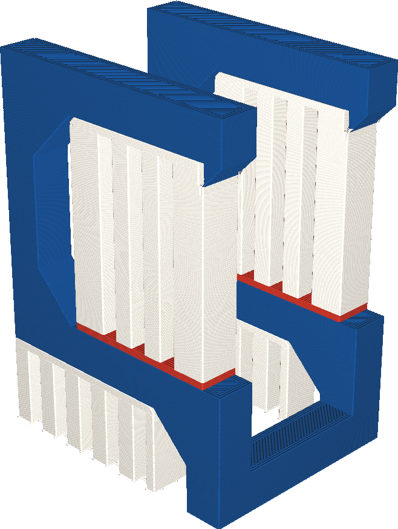

Extruder für Bodenstruktur
====
Wenn Ihr Drucker mit mehreren Extrudern ausgestattet ist, kann die Unterseite des Supports, wo der Support auf dem Modell aufliegt, mit einem anderen Extruder gedruckt werden als das Dach des Supports, wo das Modell auf dem Support aufliegt. Mit dieser Einstellung können Sie wählen, welcher Extruder für den Support-Boden verwendet wird.

<!--screenshot {
"image_path": "support_bottom_extruder_nr.png",
"models": [
    {
        "script": "question_stick_clip.scad",
        "transformation": ["rotateY(90)"],
        "object_settings": {"extruder_nr": 1}
    }
],
"camera_position": [134, 134, 113],
"settings": {
    "support_enable": true,
    "support_interface_enable": true,
    "support_use_towers": false,
    "support_extruder_nr": 3,
    "support_bottom_extruder_nr": 2
},
"colour_scheme": "material_colour",
"colours": 64
}-->

Einige Materialien bieten bessere Überhangseigenschaften als andere Materialien, wenn sie als Support verwendet werden. Sie können zum Beispiel enger an die Oberfläche gedruckt werden, weil sie sich nicht chemisch mit der Oberfläche verbinden, oder sie sind wasserlöslich. Allerdings sind solche Materialien oft teuer und es dauert länger, sie zu drucken. Diese Einstellung ermöglicht es Ihnen, den Support-Boden mit einem anderen Extruder zu drucken. Dadurch kann ein Teil des teuren oder langsam druckenden Materials eingespart werden.

Der Support-Boden ist weniger wichtig als das Support-Dach für die Qualität der Überhänge. Wenn ein teures Material sparsam verwendet werden soll, ist der Support-Boden ein guter Kandidat, um mit dem günstigeren Material zu drucken.