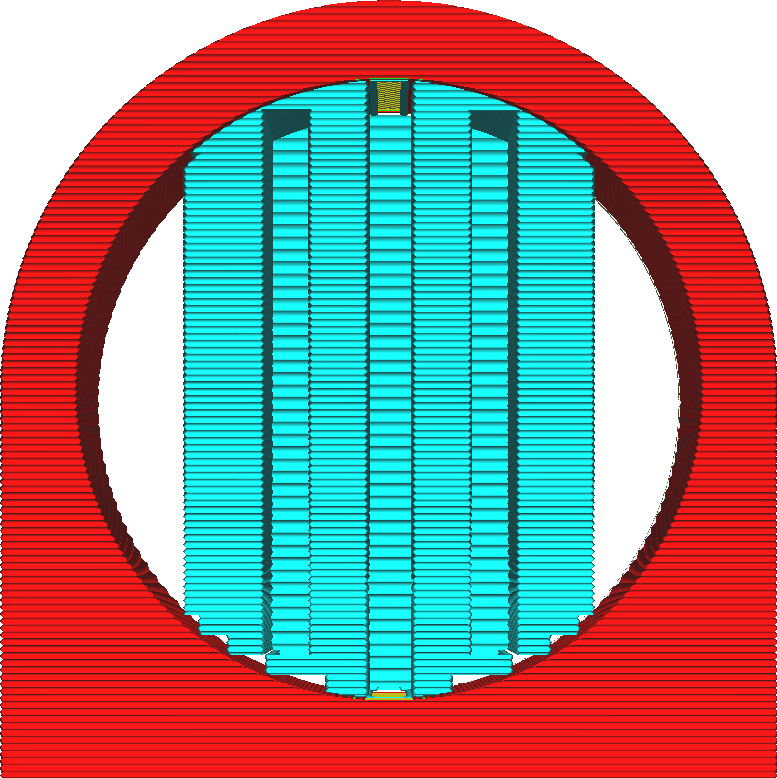

Stufenhöhe der Stützstruktur
====
Wenn [Platzierung Stützstruktur](support_type.md) auf "Überall" eingestellt ist, kann die Stützstruktur auf dem Modell aufliegen. Sie folgt jedoch nicht exakt den Konturen des Modells. Stattdessen wird die Unterseite des Supports mit einem Treppenstufenmuster versehen. Auf diese Weise stellt die Stütze nur an wenigen Stellen eine Verbindung zum Modell her.

Diese Einstellung bestimmt die Höhe dieser Stufen.

<!--screenshot {
"image_path": "support_bottom_stair_step_height.png",
"models": [{"script": "standing_ring.scad"}],
"camera_position": [0, 136, 10],
"camera_lookat": [0, 0, 10],
"settings": {
    "support_enable": true,
    "support_bottom_stair_step_height": 1
},
"colours": 64
}-->

Die Höhe der Treppenstufen wird nach dem Abstand von der Oberfläche des Modells berechnet. Das heißt, wenn Sie in der Einstellung [Unterer Abstand der Stützstruktur](support_bottom_distance.md) einen vertikalen Abstand eingestellt haben, wird dieser von der Höhe abgezogen und die Verbindung zwischen Modell und Support wird größer. In ähnlicher Weise bewirkt die Einstellung [Stützboden aktivieren](support_bottom_enable.md), dass die Wirkung der Treppenstufen reduziert wird.

Die Einstellung [Max. Stufenhöhe der Stützstruktur](support_bottom_stair_step_width.md) begrenzt die Breite der Stufen. Wenn die Oberfläche des Modells so flach ist, dass eine kleine Stufenhöhe zu einer großen Stufenbreite führen würde, folgt der Support der Oberfläche des Modells für den Rest der Stufenhöhe.

Eine Verringerung dieser Einstellung bewirkt, dass die Unterseite des Supports glatter wird. Dadurch wird die Haftung zwischen Support und Modell erhöht, was das Entfernen des Supports erschwert, aber auch die Stabilität des Supports erhöht.