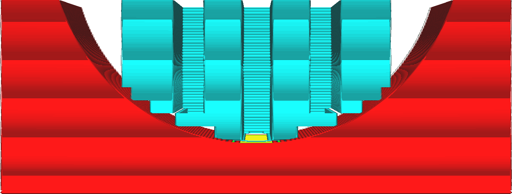
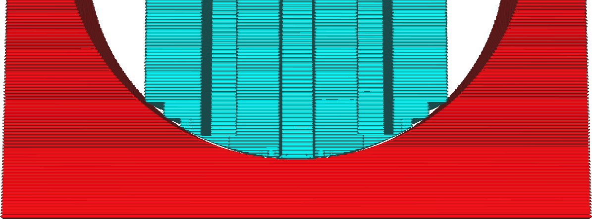

Stützstufe minimaler Neigungswinkel
====
Mit dieser Einstellung können Sie die Treppenstufen an der Unterseite des Supports deaktivieren, bis die Steigung des Modells einen bestimmten Winkel erreicht hat.

<!--screenshot {
"image_path": "support_bottom_stair_step_min_slope_10.png",
"models": [{"script": "standing_ring.scad"}],
"camera_position": [0, 82, 10],
"camera_lookat": [0, 0, 10],
"settings": {
    "support_enable": true,
    "support_bottom_stair_step_height": 1,
    "support_bottom_stair_step_min_slope": 10
},
"layer": 250,
"colours": 64
}-->
<!--screenshot {
"image_path": "support_bottom_stair_step_min_slope_30.png",
"models": [{"script": "standing_ring.scad"}],
"camera_position": [0, 82, 10],
"camera_lookat": [0, 0, 10],
"settings": {
    "support_enable": true,
    "support_bottom_stair_step_height": 1,
    "support_bottom_stair_step_min_slope": 30
},
"layer": 250,
"colours": 64
}-->

Bei flachen Steigungen können die Treppenstufen am unteren Ende sehr breit sein. Sie können nie breiter sein, als die [Max. Stufenhöhe der Stützstruktur](support_bottom_stair_step_width.md) angibt, aber da dieser Abstand von allen Seiten eingehalten wird, können die Treppenstufen so breit werden, dass die Stütze eine beträchtliche Strecke überbrücken muss. Wenn es ein kleines Tal gibt, in dem die Stütze ruht, kann dies sogar dazu führen, dass die gesamte Unterseite überspringt und die gesamte Stütze nur auf den Ecken der Treppenstufen aufliegt.

Für diese Fälle können Sie die Treppenstufen auf die steileren Neigungen beschränken. Diese Einstellung bestimmt, was eine "steile" Neigung in dieser Hinsicht ist.

Wenn Sie diese Einstellung erhöhen, verhindert Cura, dass die Treppenstufen auf flachen Oberflächen erzeugt werden. Das macht den Support stabiler, aber schwieriger zu entfernen. Ihr Support wird mehr Narben auf der Oberfläche hinterlassen. Wenn Sie die Einstellung verringern, lässt sich die Stütze leichter entfernen und hinterlässt eine schönere Oberfläche an der Stelle, an der die Stütze auflag, aber in einigen Fällen kann dies dazu führen, dass die Stütze lange Strecken überbrücken muss oder sogar komplett in der Luft zu hängen scheint.

Um eine schöne Oberfläche zu erhalten, ist es am besten, diese Einstellung auf einem konservativen, niedrigen Winkel von 5° oder 10° oder so zu belassen. Wenn der Support auf einer flachen, aber nicht ganz ebenen Oberfläche ruht, sollten Sie die Schichtansicht überprüfen und den Winkel erhöhen, wenn Sie feststellen, dass der Support sehr unsicher aussieht.