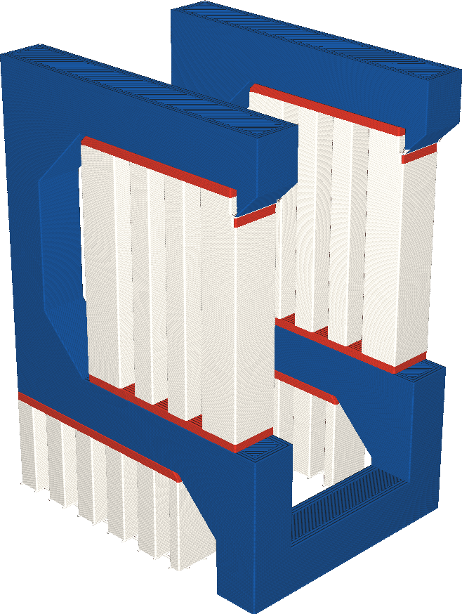

Extruder für Stützstruktur-Schnittstelle
====
Wenn Ihr Drucker mit mehreren Extrudern ausgestattet ist, können die Schichten, an denen der Support das Modell berührt, mit einem anderen Extruder gedruckt werden als der Hauptkörper des Supports. Mit dieser Einstellung können Sie wählen, welcher Extruder für die Support-Schnittstelle verwendet wird.

<!--screenshot {
"image_path": "support_interface_extruder_nr.png",
"models": [
    {
        "script": "question_stick_clip.scad",
        "transformation": ["rotateY(90)"],
        "object_settings": {"extruder_nr": 1}
    }
],
"camera_position": [134, 134, 113],
"settings": {
    "support_enable": true,
    "support_interface_enable": true,
    "support_use_towers": false,
    "support_extruder_nr": 3,
    "support_interface_extruder_nr": 2
},
"colour_scheme": "material_colour",
"colours": 64
}-->

Einige Materialien eignen sich besser zum Drucken von Support als andere. Sie haften beispielsweise chemisch nicht am Baumaterial und lassen sich daher leichter entfernen, oder sie lösen sich in Wasser oder Alkohol auf. Allerdings sind solche Materialien oft teuer und es dauert länger, sie zu drucken. Mit dieser Einstellung können Sie die Support-Schnittstelle mit einem anderen Extruder als den Hauptkörper drucken, so dass der größte Teil des Supports immer noch schnell und/oder mit billigeren Materialien gedruckt wird, aber die Vorteile des spezialisierten Support-Materials trotzdem zum Tragen kommen.

Wenn Sie lösliche Materialien zum Drucken der Support-Schnittstelle, aber unlösliche Materialien zum Drucken des Support-Körpers verwenden, bedenken Sie, dass der Körper möglicherweise nicht aus Hohlräumen entfernt werden kann, wenn es physikalisch nicht möglich ist, den Support-Körper durch eine kleine Öffnung zu bewegen. Wo ein lösliches Material normalerweise durch einen Hohlraum herausfließen kann, können unlösliche Materialien möglicherweise nicht hindurchgehen.