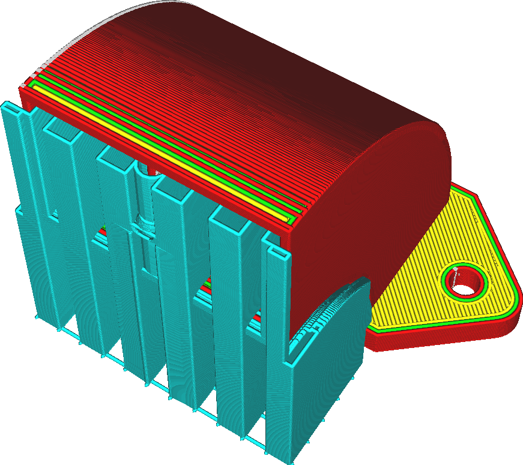

Horizontale Erweiterung der Stützstruktur
====
Diese Einstellung bewirkt, dass der Support etwas breiter wird und sich horizontal in alle Richtungen ausdehnt.

<!--screenshot {
"image_path": "support_offset.png",
"models": [{"script": "duct.scad"}],
"camera_position": [47, 72, 128],
"settings": {
    "support_enable": true,
    "support_offset": 1.8
},
"colours": 64
}-->

Diese Einstellung hat mehrere Verwendungszwecke, je nach dem für den Support verwendeten Material und der Art des Modells, das gestützt werden muss:
* Wenn Sie diese Einstellung erhöhen, wird der Support breiter und damit stabiler. Dies ist nützlich für hohe Modelle mit kleinen Überhängen, da der Überhang sonst von einem sehr hohen, dünnen Pfeiler gestützt würde. Mit einer gewissen horizontalen Erweiterung wird er zu einem sehr hohen, aber etwas breiteren Support-Pfeiler.
* Die Erhöhung dieser Einstellung dient auch als Sicherheitsmaßnahme, um sicherzustellen, dass die Support-Bereiche eine bestimmte Mindestfläche haben. Dies ist bei schwer zu extrudierenden Materialien wie PVA notwendig.
* Eine Verringerung dieser Einstellung reduziert den Materialverbrauch und die Druckzeit für den Support. Wenn Sie die Einstellung erhöhen, erhöht sich natürlich der Materialbedarf und die Druckzeit. Siehe auch die Funktion [Konische Stützstruktur](support_conical_enabled.md), die die Breite des Supports reduziert, ohne die Fläche, die der Support unterstützt, zu beeinträchtigen.
* Wenn Sie diese Einstellung auf einen negativen Wert setzen, können Sie auch dünne Stützpfeiler vollständig entfernen. Wenn der Support ohnehin nicht gedruckt würde, ist es vielleicht besser, ihn ganz wegzulassen. Eine Methode, um Support zu entfernen, ohne die Überhangqualität des restlichen Modells zu beeinträchtigen, ist das Tool Support Blocker.