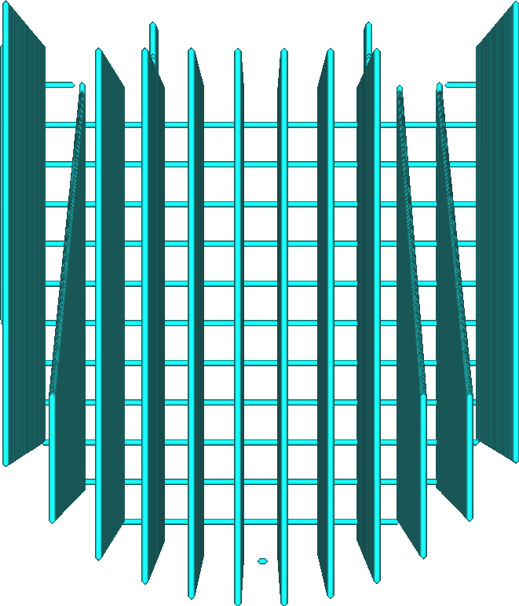

Muster der Stützstruktur
====
Mit dieser Einstellung können Sie das Muster auswählen, das zum Ausfüllen des Volumens der Support-Struktur verwendet werden soll. Verschiedene Muster haben unterschiedliche Stärken und Schwächen.

<!--screenshot {
"image_path": "support_pattern_lines.png",
"models": [
    {
        "script": "calendar_holder.scad",
        "transformation": ["rotateX(90)"]
    }
],
"camera_position": [0, 0, 135],
"settings": {
    "support_enable": true,
    "support_pattern": "lines"
},
"structures": ["helpers"],
"colours": 16
}-->
Linien
----

Das Linienmuster zeichnet gerade Linien. Die Linien sind so ausgerichtet, dass sie nie senkrecht zu den Linien der Außenhaut verlaufen, die es unterstützen soll (standardmäßig).
* Von allen Mustern ist es am einfachsten aus dem Modell zu entfernen. Dies ist sehr nützlich, wenn es einen überhängenden Bereich gibt, der nahe an der Bauplatte liegt. Bei Bedarf können die Reste mit einem Messer weggeschnitten werden.
* Bietet zusammen mit Zigzag die beste Überhangqualität aller Muster. Die Linien liegen sehr eng beieinander und sind so ausgerichtet, dass sie nicht senkrecht zur Außenhaut verlaufen.
* Neigt dazu, instabil zu sein, da die Linien dazu neigen, umzukippen.

<!--screenshot {
"image_path": "support_pattern_grid.png",
"models": [
    {
        "script": "calendar_holder.scad",
        "transformation": ["rotateX(90)"]
    }
],
"camera_position": [0, 0, 135],
"settings": {
    "support_enable": true,
    "support_pattern": "grid"
},
"structures": ["helpers"],
"colours": 16
}-->
Gitter
----

Das Gittermuster zeichnet zwei Sätze von geraden Linien, die senkrecht zueinander stehen. Sie überschneiden sich und bilden ein Muster aus Quadraten. Standardmäßig wird ein Perimeter um dieses Muster gezeichnet.
* Sehr stabil, wächst zuverlässig.
* Bietet eine mittelmäßige Überhangqualität, da die Linien ziemlich weit auseinander liegen.
* Kann schwer zu entfernen sein, da sich der Support nicht stark biegen lässt.

<!--screenshot {
"image_path": "support_pattern_triangles.png",
"models": [
    {
        "script": "calendar_holder.scad",
        "transformation": ["rotateX(90)"]
    }
],
"camera_position": [0, 0, 135],
"settings": {
    "support_enable": true,
    "support_pattern": "triangles"
},
"structures": ["helpers"],
"colours": 16
}-->
Dreiecke
----

Das Dreieckmuster zeichnet drei Sätze von geraden Linien in 60-Grad-Winkeln zueinander und bildet so ein Muster aus gleichseitigen Dreiecken. Standardmäßig wird ein Perimeter um dieses Muster gezeichnet.
* Das stabilste aller Support-Muster.
* Bietet eine schlechte Überhangqualität, da die Linien sehr weit voneinander entfernt sind.
* Kann schwer zu entfernen sein, da sich der Support in keine Richtung biegen lässt.

<!--screenshot {
"image_path": "support_pattern_concentric.png",
"models": [
    {
        "script": "calendar_holder.scad",
        "transformation": ["rotateX(90)"]
    }
],
"camera_position": [0, 0, 135],
"settings": {
    "support_enable": true,
    "support_pattern": "concentric"
},
"structures": ["helpers"],
"colours": 16
}-->
Konzentrisch
----

Das konzentrische Muster bewirkt, dass der Support aus konzentrischen Ringen besteht, die von außen nach innen gleichmäßig verteilt sind.
* Die Linien liegen dicht beieinander und bieten einen guten Support für die Überhangbereiche, so dass eine glatte Oberfläche entsteht, wenn die Linien senkrecht ausgerichtet sind.
* Ziemlich stabil, da die Schlaufen einzeln eine große Breite haben, um darauf zu stehen.
* Leicht zu entfernen, da sich die Support-Struktur leicht nach innen biegen lässt.
* Sie endet oft parallel zu den Wänden, die sie stützen soll. Dies führt zu einer schlechteren Qualität des Überhangs, da einige Wände überhaupt nicht unterstützt werden.
* Führt manchmal dazu, dass der Support in der Luft schwebt.

<!--screenshot {
"image_path": "support_pattern_zigzag.png",
"models": [
    {
        "script": "calendar_holder.scad",
        "transformation": ["rotateX(90)"]
    }
],
"camera_position": [0, 0, 135],
"settings": {
    "support_enable": true,
    "support_pattern": "zigzag"
},
"structures": ["helpers"],
"colours": 16
}-->
Zigzag
----

Das Zickzackmuster ist wie das Linienmuster, aber die Linien sind an den Enden verbunden.
* Ziemlich stabil, was die Zuverlässigkeit deutlich erhöht.
* Bietet zusammen mit dem Linienmuster die beste Überhangqualität von allen Mustern. Die Linien liegen sehr eng beieinander und sind so ausgerichtet, dass sie nicht senkrecht zur Außenhaut verlaufen.
* Leicht zu entfernen. Die Support-Struktur biegt sich nach innen, und wenn man daran zieht, zieht sich der Support in Streifen ab.
* Der Support wird fast immer in einer einzigen Linie gezogen, wodurch sich die Notwendigkeit von Rückzügen oder Fahrbewegungen minimiert.

<!--screenshot {
"image_path": "support_pattern_cross.png",
"models": [
    {
        "script": "calendar_holder.scad",
        "transformation": ["rotateX(90)"]
    }
],
"camera_position": [0, 0, 135],
"settings": {
    "support_enable": true,
    "support_pattern": "cross"
},
"structures": ["helpers"],
"colours": 16
}-->
Kreuz
----

Das Kreuzmuster zeichnet ein fraktioniertes Muster mit kreuzähnlichen Formen im gesamten Volumen.
* Von allen Mustern ist es am einfachsten zu biegen, da es keine langen geraden Linien in diesem Muster gibt.
* Der Support wird fast immer in einer einzigen Linie gezogen, wodurch sich die Notwendigkeit von Rückzügen oder Fahrbewegungen minimiert.

<!--screenshot {
"image_path": "support_pattern_gyroid.png",
"models": [
    {
        "script": "calendar_holder.scad",
        "transformation": ["rotateX(90)"]
    }
],
"camera_position": [0, 0, 135],
"settings": {
    "support_enable": true,
    "support_pattern": "gyroid"
},
"structures": ["helpers"],
"colours": 16
}-->
<!--if cura_version >= 4.1-->
Gyroid
----

Das Gyroid-Muster ist wellenförmig, mit einer Kurve, die sich hin und her schlängelt. Die Kurve variiert über die Schichten hinweg.
* Ziemlich stabiles Muster, das die Zuverlässigkeit erhöht.
* Die Luft zwischen den Supports ist ein einziges Volumen. Wenn mit löslichen Support-Materialien gedruckt wird, kann das Lösungsmittel (Wasser, Ethanol oder anderes) in das gesamte Innere der Support-Struktur eindringen, auch wenn sich darunter ein Brim befindet. Dadurch kann es den Support schneller auflösen.
* Unterstützt alle Linien im Überhang gleichmäßig, unabhängig von ihrer Richtung.
<!--endif-->