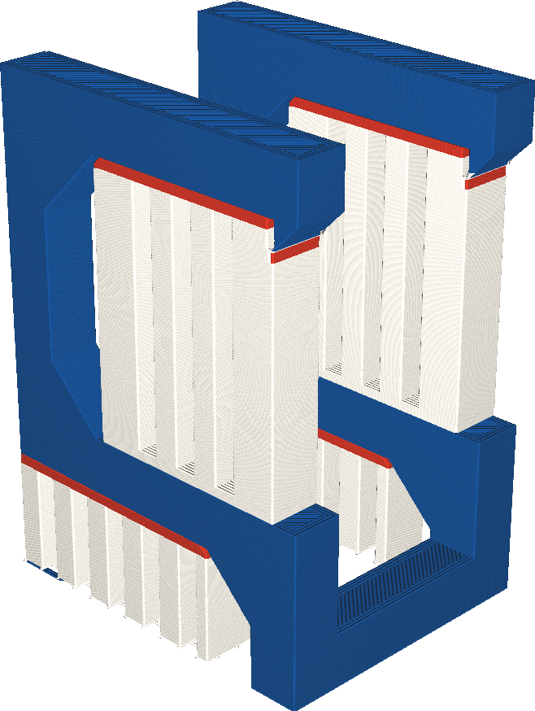

Extruder für Dachstruktur
====
Wenn Ihr Drucker mit mehreren Extrudern ausgestattet ist, kann die Oberseite des Supports, wo das Modell auf dem Support ruht, mit einem anderen Extruder gedruckt werden als der Boden des Supports, wo der Support auf dem Modell ruht. Mit dieser Einstellung können Sie wählen, welcher Extruder für das Support-Dach verwendet wird.

<!--screenshot {
"image_path": "support_roof_extruder_nr.png",
"models": [
    {
        "script": "question_stick_clip.scad",
        "transformation": ["rotateY(90)"],
        "object_settings": {"extruder_nr": 1}
    }
],
"camera_position": [134, 134, 113],
"settings": {
    "support_enable": true,
    "support_interface_enable": true,
    "support_use_towers": false,
    "support_extruder_nr": 3,
    "support_roof_extruder_nr": 2
},
"colour_scheme": "material_colour",
"colours": 64
}-->

Einige Materialien haben bessere Überhangseigenschaften als andere Materialien, wenn sie als Support verwendet werden. Sie können zum Beispiel enger an die Oberfläche gedruckt werden, weil sie sich nicht chemisch mit der Oberfläche verbinden, oder weil sie wasserlöslich sind. Allerdings sind solche Materialien oft teuer und es dauert länger, sie zu drucken. Diese Einstellung ermöglicht es Ihnen, das Support-Dach mit einem anderen Extruder zu drucken als den Support-Boden. Auf diese Weise wird das teure oder langsame Material sparsam verwendet, aber es ist immer noch in der Lage, gute Überhänge zu erzeugen.

Das Support-Dach ist für die Qualität der Überhänge wichtiger als der Support-Boden. Wenn also ein teures Material sparsam verwendet werden soll, ist es am besten, es zumindest für das Support-Dach zu verwenden.