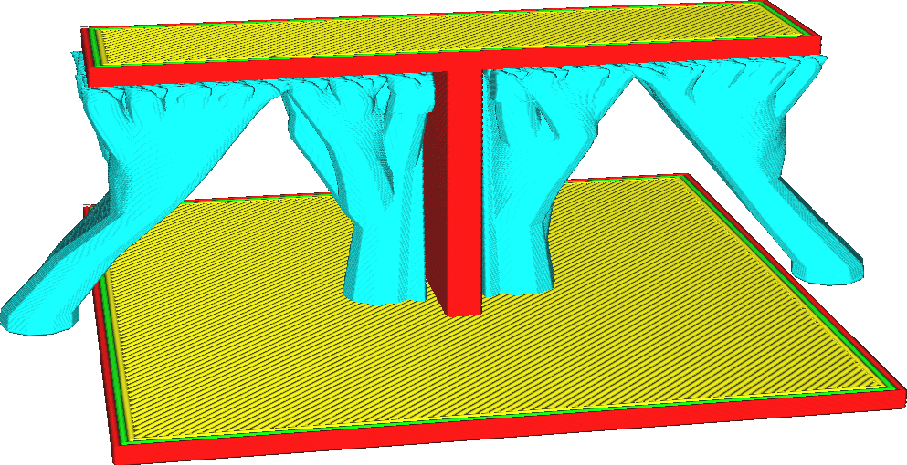

Astwinkel der Baumstützstruktur
====
Diese Einstellung legt den maximalen Überhangwinkel fest, den die Zweige der Baumstütze haben dürfen. Wenn der Winkel vergrößert wird, können die Äste horizontaler gedruckt werden, so dass sie weiter reichen.

<!--screenshot {
"image_path": "support_tree_angle_20.png",
"models": [{"script": "over_t.scad"}],
"camera_position": [-23, 124, 45],
"settings": {
    "support_enable": true,
    "support_structure": "tree",
    "support_tree_collision_resolution": 0.02,
    "support_tree_angle": 20
},
"colours": 64
}-->
<!--screenshot {
"image_path": "support_tree_angle_40.png",
"models": [{"script": "over_t.scad"}],
"camera_position": [-23, 124, 45],
"settings": {
    "support_enable": true,
    "support_structure": "tree",
    "support_tree_collision_resolution": 0.02,
    "support_tree_angle": 40
},
"colours": 64
}-->

Durch Verkleinern des Astwinkels werden die Äste vertikaler. Wird er vergrößert, werden sie horizontaler. Da die Äste einen größeren Überhangswinkel haben dürfen, können sie weiter um Hindernisse herumreichen, so dass die Stütze öfter auf der Bauplatte und nicht auf dem Modell aufliegt. Außerdem können sich die Äste zu einem späteren Zeitpunkt voneinander trennen.

Zu den wichtigsten Auswirkungen der Vergrößerung des Astwinkels für den Support von Bäumen gehören:
* Geringere Narbenbildung, da weniger Support auf dem Modell und nicht auf der Bauplatte aufliegen muss. Wenn die [Platzierung der Stützstruktur](../support/support_type.md) auf "Druckbett berühren" eingestellt ist, kann ein größerer Teil des Modells unterstützt werden.
* Geringere Druckzeit und geringerer Materialverbrauch, da sich die Äste in höheren Lagen abspalten. Die Äste werden gerade rechtzeitig abgespalten, um den gesamten Überhang erreichen zu können.
* Geringere Zuverlässigkeit. Wenn der Überhangwinkel zu groß wird, wird der Support stark geschwächt, was die Wahrscheinlichkeit erhöht, dass der Support bricht oder umkippt.

Große Astwinkel werden am besten mit niedrigen Werten für die Einstellung [Kollisionsauflösung der Baumstützstruktur](support_tree_collision_resolution.md) kombiniert. Dadurch werden die Positionsverschiebungen des Baums aufgrund der Kollisionsvermeidung reduziert. Dadurch wird verhindert, dass der Überhangabstand zu groß wird, wenn der Kollisionsabstand angepasst wird.