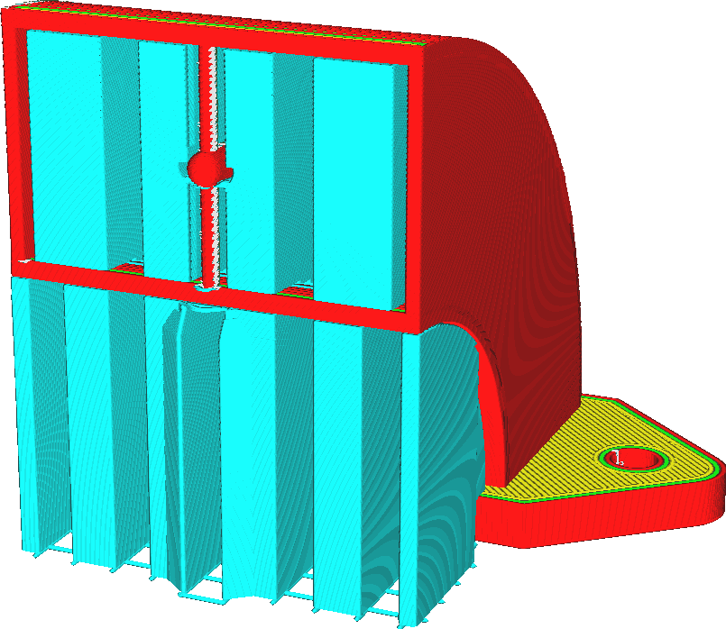

Platzierung Stützstruktur
====
Mit dieser Einstellung können Sie festlegen, wo der Support platziert werden kann.

<!--screenshot {
"image_path": "support_type_everywhere.png",
"models": [{"script": "duct.scad"}],
"camera_position": [56, 127, 60],
"settings": {
    "support_enable": true,
    "support_type": "everywhere"
},
"colours": 32
}-->
<!--screenshot {
"image_path": "support_type_touching_buildplate.png",
"models": [{"script": "duct.scad"}],
"camera_position": [56, 127, 60],
"settings": {
    "support_enable": true,
    "support_type": "buildplate"
},
"colours": 32
}-->

Wenn die Stützen überall platziert werden, ist das zuverlässiger für die Stütze. Alle Überhänge, die sich durchbiegen würden, werden richtig gestützt. Allerdings kann die Stütze auch dort, wo sie auf dem Modell aufliegen, eine Narbe hinterlassen. Dies mindert die optische Qualität und die Glätte der Oberfläche des Modells, nachdem der Support entfernt wurde.

Wenn Sie den Support nur dann anbringen, wo er die Bauplatte berührt, wird verhindert, dass der Support auf dem Modell aufliegt. Dies kann jedoch dazu führen, dass einige Teile des Modells nicht abgestützt werden.

**Als Trick, wenn Sie Support nur auf der Bauplatte verwenden, aktivieren Sie die [Konische Stützstruktur](../experimental/support_conical_enabled.md) und geben Sie dem [Winkel der konischen Stützstruktur](../experimental/support_conical_angle.md) einen negativen Wert. Auf diese Weise kann der Support um das Modell herum wachsen und trotzdem den größten Teil des Netzes stützen, ohne auf dem Modell aufzuliegen. Alternativ können Sie auch die Baumstützstruktur verwenden.**