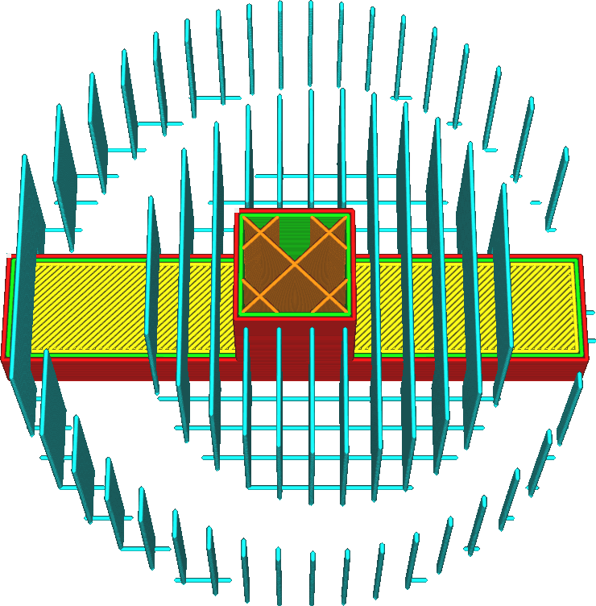

Anzahl der Wandlinien der Stützstruktur
====
Diese Einstellung fügt eine Reihe von Wänden um den Support herum hinzu.

<!--screenshot {
"image_path": "support_wall_count_0.png",
"models": [{"script": "plug.scad"}],
"camera_position": [0, 66, 169],
"settings": {
    "support_enable": true,
    "support_pattern": "lines",
    "support_offset": 0.2,
    "support_wall_count": 0
},
"layer": 236,
"colours": 64
}-->
<!--screenshot {
"image_path": "support_wall_count_3.png",
"models": [{"script": "plug.scad"}],
"camera_position": [0, 66, 169],
"settings": {
    "support_enable": true,
    "support_pattern": "lines",
    "support_offset": 0.2,
    "support_wall_count": 3
},
"layer": 236,
"colours": 64
}-->

Die zusätzlichen Wände verleihen dem Support zusätzliche Stabilität und verringern die Gefahr, dass er umkippt. Außerdem kann der Support so die Kanten des Überhangs besser abstützen. Bei Modellen mit scharfen Ecken sind diese Kanten oft problematisch, weil die Linien dort in der Luft enden. Mit dieser Einstellung können sie stattdessen auf einer Support-Linie enden.

Allerdings benötigen die zusätzlichen Wände auch mehr Zeit zum Drucken, verbrauchen mehr Material und machen es schwieriger, den Support anschließend vom Objekt zu entfernen. Bei der Arbeit mit löslichen Support-Materialien führen die zusätzlichen Wände dazu, dass der Support länger braucht, um sich aufzulösen, weil das Lösungsmittel nicht mehr von der Seite in die Support-Struktur eindringen kann.