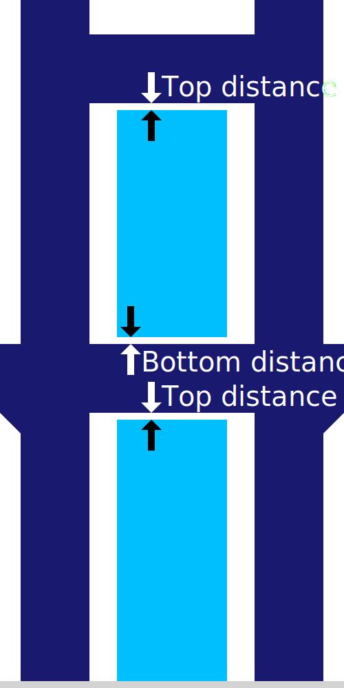
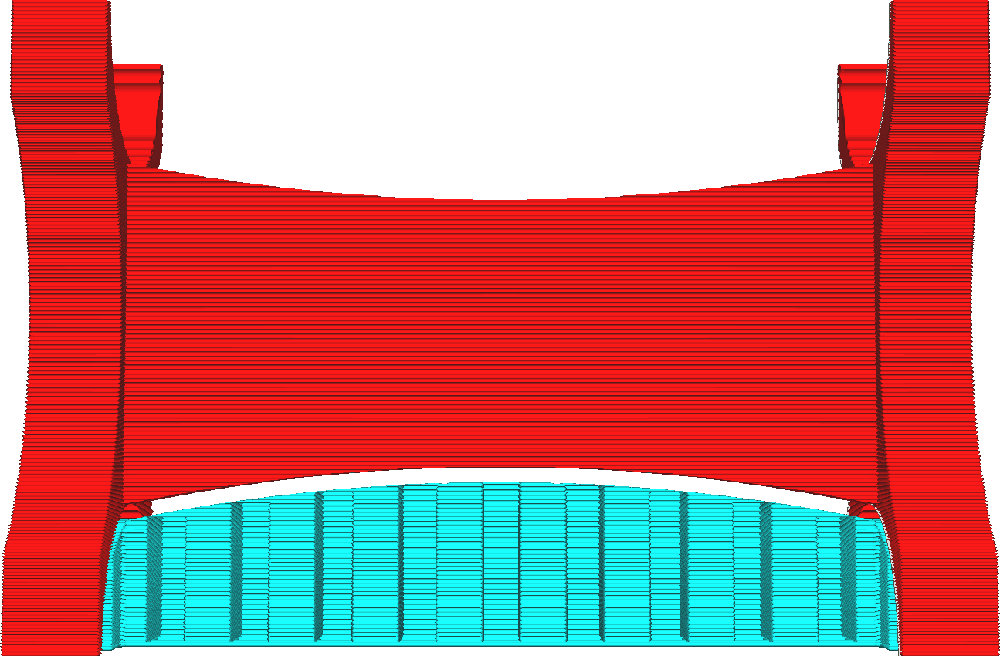

Z-Abstand der Stützstruktur
====
Diese Einstellung gibt den vertikalen Abstand an, der zwischen dem Support und dem Modell eingehalten werden muss, und zwar sowohl an der Oberseite des Supports als auch an der Unterseite.

<!--screenshot {
"image_path": "support_z_distance.png",
"models": [{"script": "rack.scad"}],
"camera_position": [0, 129, 11],
"settings": {
    "support_enable": true,
    "support_z_distance": 1
},
"colours": 32
}-->

Diese Einstellung hat den größten Einfluss darauf, wie gut der Support am Modell haftet.

Wenn diese Einstellung verringert wird, haftet der Support besser am Modell. Dadurch sehen Überhänge besser aus, da sie nicht so stark durchhängen können. Außerdem wird die Stabilität des Supports verbessert, da er an der Unterseite des Supports fest auf dem Modell sitzt.

Wenn diese Einstellung erhöht wird, lässt sich der Support leichter entfernen. Sie hinterlässt weniger Narben auf der Oberfläche, auf der der Support das Modell abgestützt hat. Andererseits wird das Modell nicht mehr so gut gestützt. Dadurch verringert sich die Oberflächenqualität der Überhänge.

Generell gilt: Je besser das Support-Material auf dem Baumaterial haftet, desto größer muss diese Einstellung sein. Wenn Sie ein anderes Material zum Drucken des Supports verwenden, kann der Z-Abstand deutlich verringert werden, da sich zwei unterschiedliche Materialien nach dem Aushärten leichter trennen. Wenn Sie ein Material mit guter Schichthaftung verwenden, muss die Einstellung etwas erhöht werden. Wenn Sie heißer oder mit dickeren Linien drucken, erhöht sich auch die Haftung, so dass auch diese Einstellung erhöht werden muss.