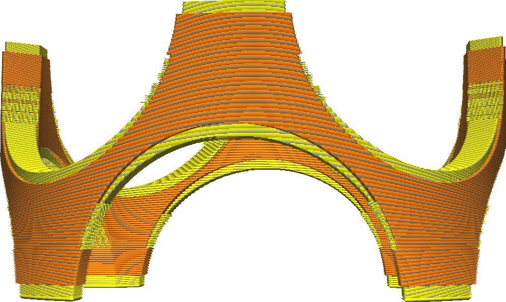

Expansionsdistanz Außenhaut unten
====
Mit dieser Funktion können Sie die festen Schichten an der Unterseite des Drucks in horizontaler Richtung breiter oder dünner machen. Normalerweise werden die festen Schichten nur über Teilen erzeugt, unter denen sich Luft befindet. Mit dieser Einstellung können Sie sie jedoch horizontal etwas weiter ausdehnen und so die Festigkeit verbessern, indem Sie die Außenhaut besser an den angrenzenden Wänden befestigen und Lücken in der Außenhaut schließen.

<!--screenshot {
"image_path": "skin_preshrink_original.png",
"models": [{"script": "stature_symmetrical.scad"}],
"camera_position": [104, -7, 4],
"settings": {
    "wall_line_count": 0,
    "infill_wall_line_count": 1,
    "bottom_skin_preshrink": 0,
    "top_skin_preshrink": 0,
    "bottom_skin_expand_distance": 0,
    "top_skin_expand_distance": 0
},
"colours": 32
}-->
<!--screenshot {
"image_path": "expand_skins_expand_distance_1mm.png",
"models": [{"script": "stature_symmetrical.scad"}],
"camera_position": [104, -7, 4],
"settings": {
    "wall_line_count": 0,
    "infill_wall_line_count": 1,
    "bottom_skin_expand_distance": 1,
    "top_skin_expand_distance": 1
},
"colours": 32
}-->

* Wenn Sie kleine Löcher in den unteren Schichten der Außenhaut haben (Löcher, die mit dem Füllmuster gefüllt werden), können Sie diese mit einem etwas höheren Wert schließen. Dadurch kann der Drucker kontinuierlich Bodenlinien drucken, was die Festigkeit erheblich verbessert.
* Wenn Sie eine Unterseite haben, die nicht direkt auf der Bauplatte liegt, befinden sich Wände unter der Außenhaut. Dadurch wird die Haftung zwischen den unteren Schichten und den benachbarten Wänden verbessert, da die unteren Schichten direkt auf die Wände gedruckt werden.
* Wenn Sie diese Einstellung auf einen negativen Wert setzen, wird die Breite der unteren Schichten reduziert und durch Füllmaterial ersetzt. Dadurch kann etwas Druckzeit eingespart werden, was jedoch auf Kosten der Festigkeit geht.

**Aufgrund technischer Beschränkungen können Sie diese Einstellung nicht unter den Wert von [Breite für das Entfernen der Außenhaut unten](bottom_skin_preshrink.md) verringern. Erhöhen Sie den Wert [Breite für das Entfernen der Außenhaut unten](bottom_skin_preshrink.md), um mehr Außenhaut zu entfernen.**