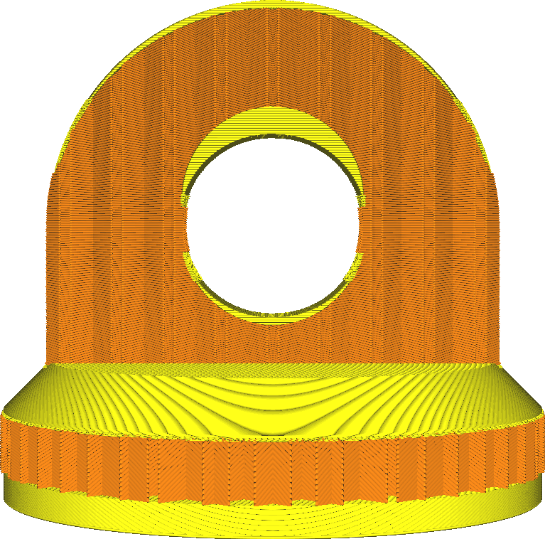

Untere Dicke
====
Mit dieser Einstellung können Sie die Dicke der festen unteren Schichten des Drucks festlegen. Ein höherer Wert sorgt dafür, dass alle Lücken in den unteren Schichten vollständig geschlossen werden. Dies kann jedoch auch die Druckzeit und die Menge des verwendeten Filaments erhöhen.

<!--screenshot {
"image_path": "top_bottom_thickness_0.8.png",
"models": [{"script": "stamp.scad"}],
"camera_position": [0, 203, 30],
"settings": {
    "wall_line_count": 0,
    "top_bottom_thickness": 0.8
},
"colours": 64
}-->
<!--screenshot {
"image_path": "bottom_thickness.png",
"models": [{"script": "stamp.scad"}],
"camera_position": [0, 203, 30],
"settings": {
    "wall_line_count": 0,
    "bottom_thickness": 3
},
"colours": 64
}-->

* Erhöhen, um die Festigkeit zu verbessern.
* Erhöhen, um Lücken auf der Unterseite des Drucks zu schließen.
* Verringern, um die Druckzeit und den Materialverbrauch zu verringern.