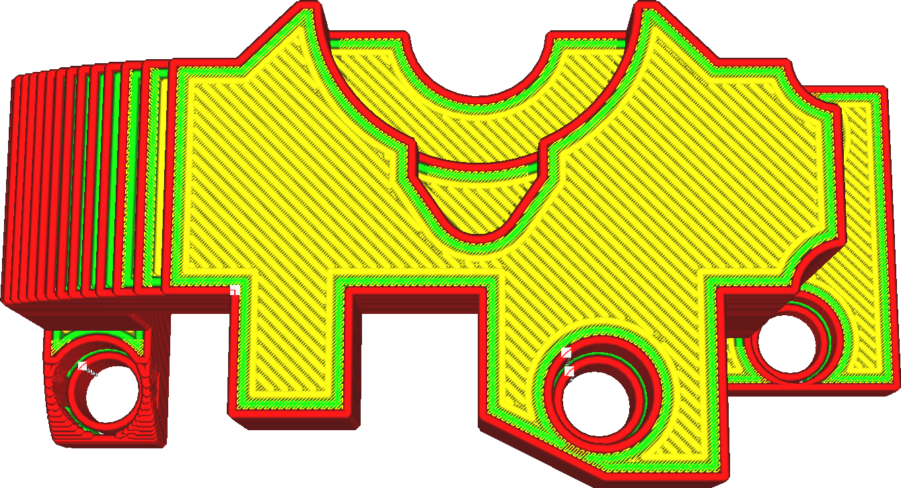
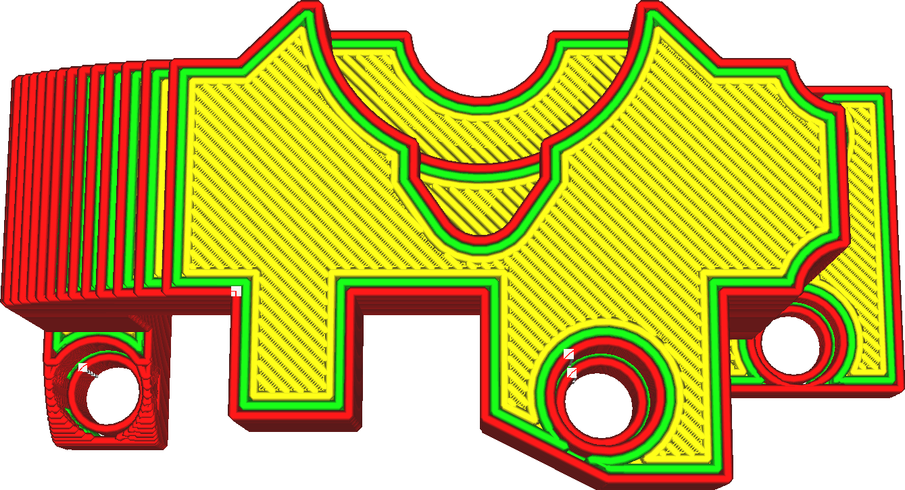

Glättungseinsatz
====
Normalerweise wird beim Glätten nicht bis zur Außenkante geglättet. Wenn dies der Fall wäre, würde der kontinuierliche Druck in der Düsenkammer dazu führen, dass das Material über die Kante fließt, was eine Art Welleneffekt verursacht. Mit dieser Einstellung legen Sie fest, wie weit entfernt von der Kante geglättet werden soll.

<!--screenshot {
"image_path": "ironing_enabled_enabled.png",
"models": [
    {
        "script": "dial_brace.scad",
        "transformation": ["scale(0.5)"]
    }
],
"camera_position": [0, 14, 83],
"settings": {
    "layer_height": 0.2,
    "ironing_enabled": true
},
"colours": 64
}-->
<!--screenshot {
"image_path": "ironing_inset.png",
"models": [
    {
        "script": "dial_brace.scad",
        "transformation": ["scale(0.5)"]
    }
],
"camera_position": [0, 14, 83],
"settings": {
    "layer_height": 0.2,
    "ironing_enabled": true,
    "ironing_inset": 1.2
},
"colours": 64
}-->

Es gibt zwei Hauptanwendungsfälle für diese Einstellung:
* Um sicherzustellen, dass sich das Material nicht über den Rand hinaus verteilt.
* Als Möglichkeit, dünne Streifen herauszufiltern, die normalerweise geglättet werden würden. Wenn Sie einen flachen Abhang haben, möchten Sie vielleicht nicht, dass jede Schicht-Stufe in diesem Abhang geglättet wird. Eine Erhöhung dieser Einstellung kann die dünnsten Streifen herausfiltern, führt aber auch dazu, dass die größeren Teile nicht bis zum Rand geglättet werden.