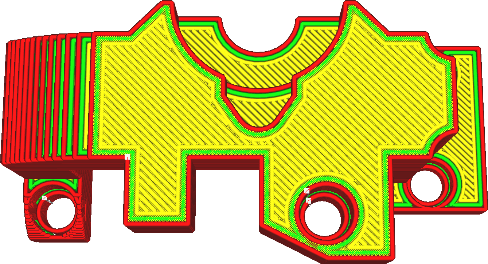

Nur oberste Schicht glätten
====
Wenn diese Einstellung aktiviert ist, wird das Glätten nur auf die oberste Schicht des Objekts angewendet. Wenn Ihr Modell viele verschiedene Oberseiten hat, aber nur die oberste sichtbar ist oder nur die oberste geglättet werden muss, können Sie mit dieser Einstellung viel Druckzeit sparen.

<!--screenshot {
"image_path": "ironing_only_highest_layer.png",
"models": [
    {
        "script": "dial_brace.scad",
        "transformation": ["scale(0.5)"]
    }
],
"camera_position": [0, 14, 83],
"settings": {
    "layer_height": 0.2,
    "ironing_enabled": true,
    "ironing_only_highest_layer": true
},
"colours": 64
}-->

**Wenn mehrere Objekte in einem Druck vorhanden sind, wird die oberste Schicht jedes Objekts geglättet. Dies gilt auch für alle Teile eines Mehrfachextrusionsdrucks.**