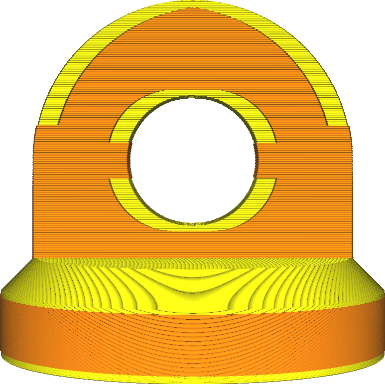
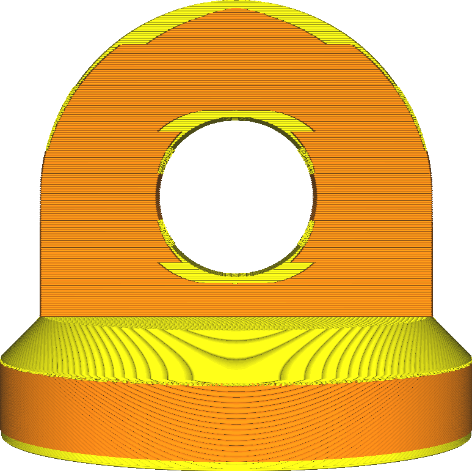

Mindestbreite Außenhaut für Expansion
====
Da die Außenhaut im gesamten Modell vorhanden ist, ist es nicht notwendig, alle diese Bereiche zu erweitern. Vielmehr werden nur die Winkel der Außenhaut erweitert, die bereits breiter als diese Einstellung sind. Auf diese Weise werden flache Oberflächen mit hervorstehenden Elementen verstärkt, ohne dass sich die Druckzeit für den Rest des Modells unnötig verlängert.

<!--screenshot {
"image_path": "max_skin_angle_for_expansion_90.png",
"models": [{"script": "stamp.scad"}],
"camera_position": [0, 200, 30],
"settings": {
    "wall_line_count": 0,
    "infill_wall_line_count": 1,
    "expand_skins_expand_distance": 3,
    "max_skin_angle_for_expansion": 90
},
"colours": 64
}-->
<!--screenshot {
"image_path": "max_skin_angle_for_expansion_45.png",
"models": [{"script": "stamp.scad"}],
"camera_position": [0, 200, 30],
"settings": {
    "wall_line_count": 0,
    "infill_wall_line_count": 1,
    "expand_skins_expand_distance": 3,
    "max_skin_angle_for_expansion": 45
},
"colours": 64
}-->

Die Erweiterung der Außenhaut ist nützlich, um die Verbindung zwischen der Ober- oder Unterseite des Drucks und den Wänden an den Seiten zu verstärken. Es kann jedoch auch die Druckzeit und den Materialverbrauch stark erhöhen. Mit dieser Einstellung können Sie das Material an den Seiten des Drucks weglassen, wo es für die Verstärkung der Verbindung zwischen Wänden und Außenhaut weniger nützlich ist.

Sie können diese Einstellung auch mit der Einstellung [Maximaler Winkel Außenhaut für Expansion](max_skin_angle_for_expansion.md) konfigurieren. Wenn diese Einstellung geändert wird, ändert sich diese Einstellung automatisch mit. Diese Einstellung ist diejenige, die tatsächlich für das Slicing verwendet wird.