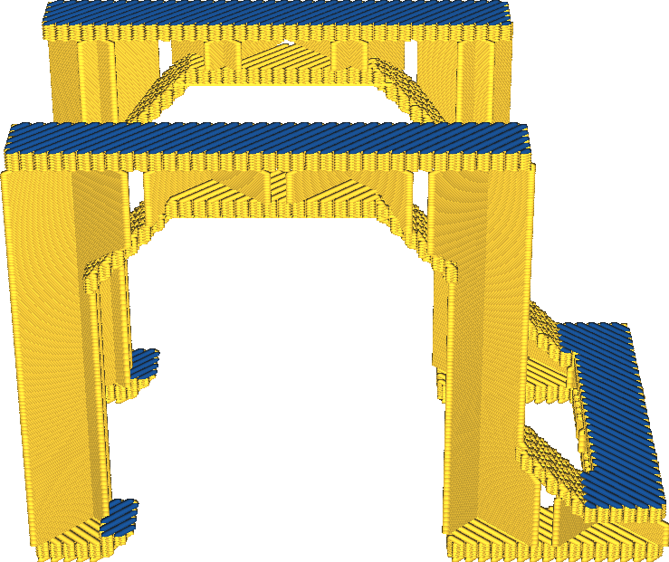

Oberfläche Außenhaut Extruder
====
Bei Druckern mit mehreren Extrudern wird hier der Extruder ausgewählt, der für den Druck der Oberfläche verwendet werden soll.

<!--screenshot {
"image_path": "roofing_extruder_nr.png",
"models": [
    {
        "script": "question_stick_clip.scad",
        "transformation": ["scale(0.5)"]
    }
],
"camera_position": [0, -90, 60],
"settings": {
    "wall_line_count": 0,
    "skin_outline_count": 0,
    "roofing_layer_count": 1,
    "roofing_extruder_nr": 1
},
"colour_scheme": "material_colour",
"colours": 32
}-->

Auf diese Weise können Sie der Oberfläche eine andere Farbe oder ein anderes Material geben. Beachten Sie, dass der Extruder für die Wände durch diese Einstellung nicht verändert wird, so dass um die Oberseite herum immer noch ein Rand zu sehen sein wird.

Abgesehen davon, dass Sie der Oberseite eine andere Farbe geben können, können Sie die Oberseite auch mit einem anderen Material bedrucken. Damit lassen sich verschiedene Effekte erzielen:
* Drucken Sie die Oberseite und die Außenwand aus PLA, während Sie den Rest mit einem steiferen Material drucken, um ein stabiles Objekt zu erhalten, das auch gut aussieht.
* Die Oberseite wird mit TPU gedruckt, der Rest mit einem härteren Material, um eine weiche, griffige Oberfläche zu erhalten.
* Drucken Sie die Oberseite mit einem Material, das glatter ist als das stärkere Material, das Sie für das Innere des Modells benötigen, wenn etwas über die Oberfläche gleiten soll.

**Wenn das Material für die Oberseite nicht gut auf dem darunter liegenden Material haftet, neigt es dazu, sich nach dem Druck zu lösen. Seien Sie besonders vorsichtig bei Materialien mit hohem Schrumpfungsverhältnis.**