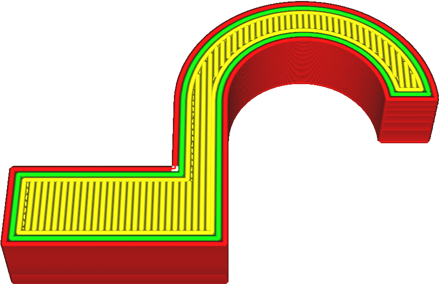

Richtungen der oberen/unteren Linie
====
Mit dieser Einstellung können Sie die Richtung ändern, in der die Linien des oberen und unteren Bereichs gedruckt werden. Sie können eine durch Komma getrennte Liste von Winkeln (in Grad) angeben, und die Linien werden pro Schicht in eine andere Richtung gedruckt.

<!--screenshot {
"image_path": "skin_angles.gif",
"models": [
    {
        "script": "microwave_hook.scad",
        "transformation": ["scale(0.5)"]
    }
],
"camera_position": [0, 48, 70],
"settings": {"skin_angles": "[0, 60, 120]"},
"layer": [76, 77, 78],
"colours": 128
}-->

Standardmäßig wird das Linienmuster in den beiden diagonalen Richtungen gedruckt. Bei kartesischen Gantry-Systemen ist dies am genauesten, da der Drucker sowohl den X- als auch den Y-Motor verwenden kann, um die Düse zu beschleunigen, wenn er für die nächste Linie umkehrt.

Es kann mehrere Gründe geben, diese Richtungen zu ändern:
* Um einen optischen Effekt zu erzielen.
* Um die Festigkeit zu optimieren. Der Druck ist normalerweise stabiler, wenn er parallel zu den Linien der Außenhaut (und der Füllung) gedrückt und gezogen wird.
* Um den Überhang zu reduzieren. Wenn ein Druck in einer Richtung sehr dünn ist, kann die Außenhaut diese Richtung überbrücken, um Material für die Füllung zu sparen. Zur Überbrückung der Lücke wird keine Füllung benötigt. In ähnlicher Weise können Sie auch eine Richtung wählen, die senkrecht zur Füllung verläuft, um den Überhang über die Füllung zu minimieren. Auf diese Weise können Sie eine bessere Qualität der Oberfläche erzielen.
* Zur Optimierung der Genauigkeit, wenn Ihr Drucker nicht über einen Motor für die X-Richtung und einen für die Y-Richtung verfügt, wie z. B. bei einem Drucker mit einem H-Brücken-Portal oder einem Delta-Drucker.

Wenn Sie beispielsweise `[0, 30, 60]` eingeben, wechselt die Richtung zwischen 0 Grad ausgehend von der X-Achse, 30 Grad ausgehend und 60 Grad ausgehend.