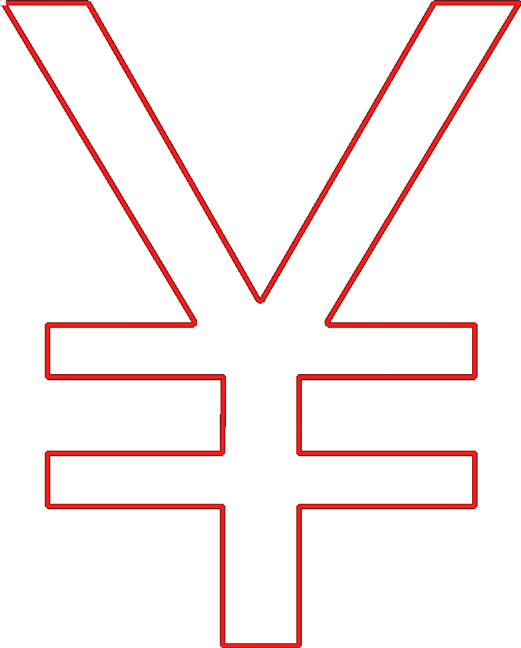
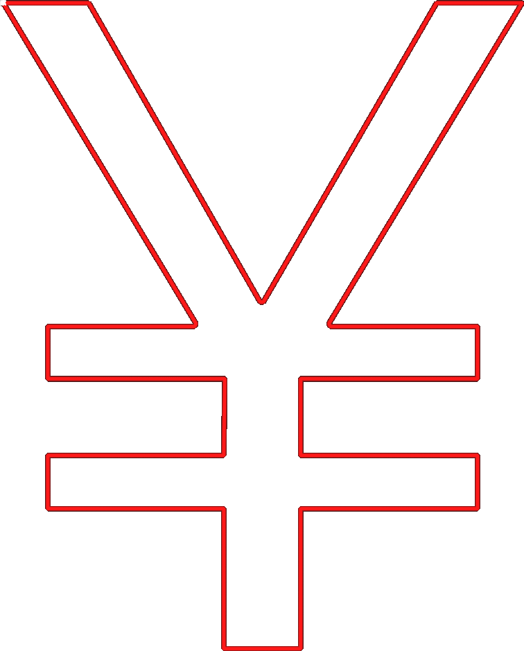
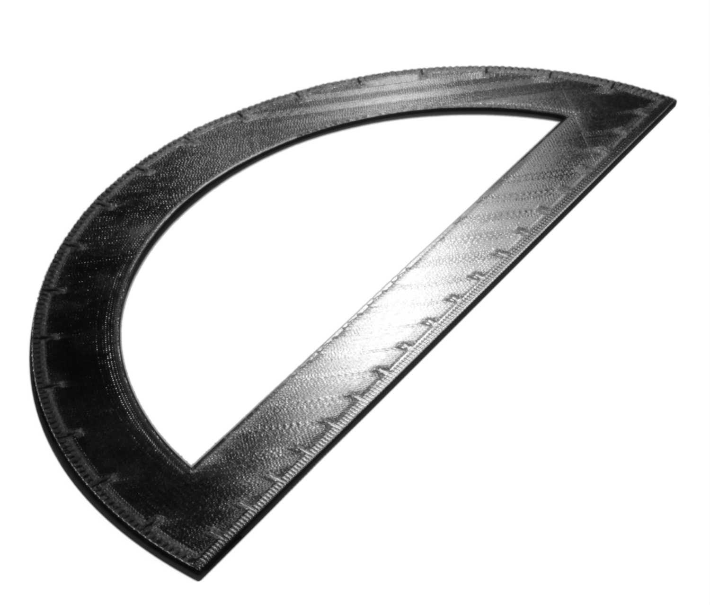
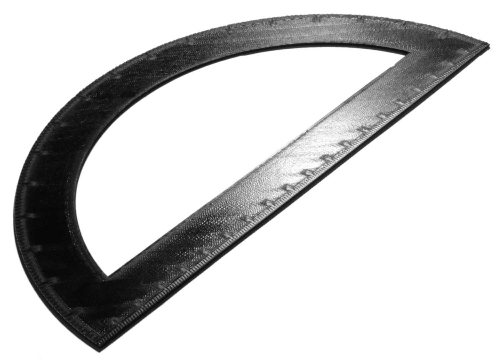

Gleichmäßige Reihenfolge oben/unten
====
Normalerweise ordnet Cura die oberen/unteren Linien so an, dass der Abstand zwischen ihnen gering ist. Wenn diese Einstellung aktiviert ist, werden die oberen/unteren Linien so angeordnet, dass benachbarte Linien immer überlappend in dieselbe Richtung gedruckt werden.

Beim Drucken von oberen/unteren Linien überlappen die Linien normalerweise ein wenig mit den benachbarten Linien, da die Form einer Linie kein perfektes Rechteck ist. Durch diese Überlappung erhalten die Linien eine leichte Neigung, wodurch sie das Licht unterschiedlich in verschiedene Richtungen reflektieren. Wenn sich benachbarte Linien unterschiedlich überlappen, ändert sich diese Reflexion. Sie können dies im Endergebnis sehen. Es verleiht verschiedenen Bereichen der Oberfläche einen unterschiedlichen Glanz. Durch das Drucken in einer monotonen Reihenfolge wird sichergestellt, dass die Überlappung auf der gesamten Oberfläche gleich ist, so dass es keine Unterschiede bei der Lichtreflexion gibt. Dadurch wirkt die Oberfläche gleichmäßiger und glatter.

<!--screenshot {
"image_path": "skin_monotonic_disabled.gif",
"models": [
    {
        "script": "yen.scad",
        "transformation": ["scale(0.5)"]
    }
],
"camera_position": [0, 0, 130],
"settings": {
    "wall_line_count": 1,
    "skin_outline_count": 0,
    "travel_compensate_overlapping_walls_enabled": false,
    "skin_monotonic": false
},
"layer": 1,
"line": [29, 45, 61, 77, 93, 109, 125, 141, 157, 161, 177, 193, 199, 211, 231, 246, 262, 280, 296, 312, 326, 342, 358, 374, 397, 417, 433, 449, 464, 480, 499],
"delay": 125,
"colours": 32
}-->
<!--screenshot {
"image_path": "skin_monotonic_enabled.gif",
"models": [
    {
        "script": "yen.scad",
        "transformation": ["scale(0.5)"]
    }
],
"camera_position": [0, 0, 130],
"settings": {
    "wall_line_count": 1,
    "skin_outline_count": 0,
    "travel_compensate_overlapping_walls_enabled": false,
    "skin_monotonic": true
},
"layer": 1,
"line": [31, 47, 63, 77, 93, 109, 115, 131, 147, 163, 181, 197, 213, 229, 244, 263, 281, 296, 319, 340, 356, 372, 379, 395, 411, 427, 443, 459, 475, 491, 507, 511],
"delay": 125,
"colours": 32
}-->

Die gleichmäßige Reihenfolge erhöht die Länge der Fahrwege geringfügig, aber dieser Effekt ist sehr gering. Sie wirkt sich nur optisch auf den Druck aus. Die gleichmäßige Reihenfolge bringt keine mechanischen Verbesserungen mit sich.

Um eine glatte Oberfläche zu erzielen, sollten Sie diese Einstellung mit der Einstellung [Combing-Modus (Nicht in Außenhaut)](../travel/retraction_combing.md) kombinieren, und vielleicht auch [Z-Sprung](../travel/retraction_hop.md) aktivieren. Alternativ könnten Sie auch [Glätten](ironing_enabled.md) aktivieren, aber das macht den Vorteil dieser Einstellung komplett zunichte. Glätten hat seine eigene [Gleichmäßige Reihenfolge](ironing_monotonic.md).

