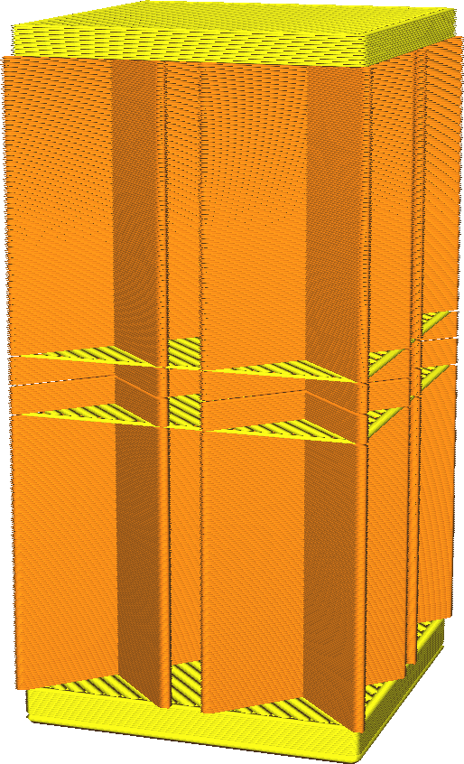

Keine Außenhaut in Z-Lücken
====
Wenn Ihr Modell einen kleinen horizontalen Spalt hat, der kleiner ist als die Dicke der Außenhaut oben/unten, wird bei dieser Einstellung die Außenhaut oben und unten nicht vollständig aufgefüllt. Dies spart Zeit beim Slicen und Drucken, kann aber dazu führen, dass Füllmaterial nach außen dringt.

<!--screenshot {
"image_path": "skin_no_small_gaps_heuristic_disabled.png",
"models": [
    {
        "script": "small_z_gap.scad",
        "scad_params": ["gap_size=0.06"]
    }
],
"camera_position": [-21, -62, 25],
"settings": {
    "wall_line_count": 0,
    "skin_no_small_gaps_heuristic": false
},
"colours": 32
}-->
<!--screenshot {
"image_path": "skin_no_small_gaps_heuristic_enabled.png",
"models": [
    {
        "script": "small_z_gap.scad",
        "scad_params": ["gap_size=0.06"]
    }
],
"camera_position": [-21, -62, 25],
"settings": {
    "wall_line_count": 0,
    "skin_no_small_gaps_heuristic": true
},
"colours": 32
}-->

Der Hauptzweck dieser Einstellung ist es, die Slicing-Zeit zu reduzieren. Diese Einstellung reduziert effektiv die Auflösung, mit der Cura prüft, wo die Außenhaut platziert werden muss. Abhängig von der Form des Modells kann dies zwischen 5% und 30% der Slicing-Zeit einsparen. Es spart auch Druckzeit, wenn kleine Lücken vorhanden sind, da anstelle der Außenhaut die Füllung gedruckt wird.

Wenn das Modell keine horizontalen Lücken aufweist, die kleiner als die Dicke der Außenhaut sind, wird die einzige Auswirkung die reduzierte Slicing-Zeit sein.

Wenn das Modell jedoch solche horizontalen Lücken aufweist, wird die Füllung in der Lücke sichtbar sein. Wenn die Lücke jedoch klein genug ist, würde der Überhang die Wände so weit durchhängen lassen, dass er ohnehin nicht sichtbar ist.