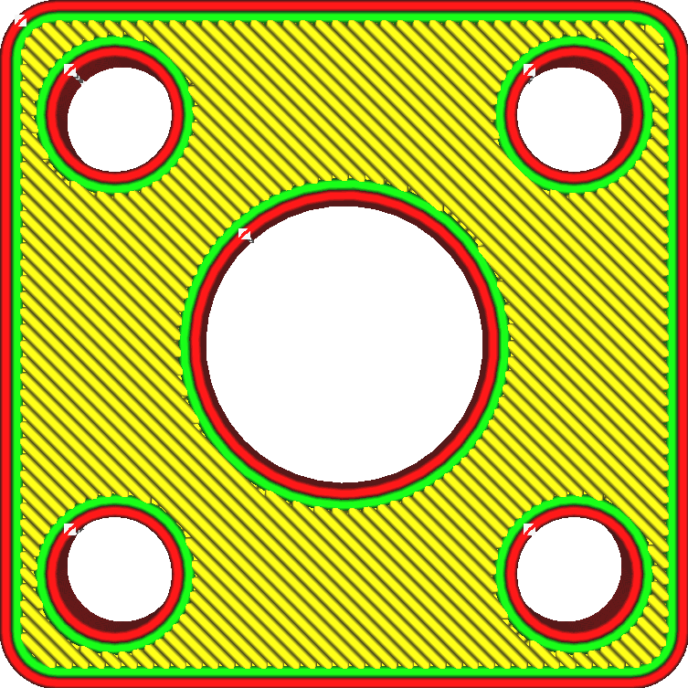
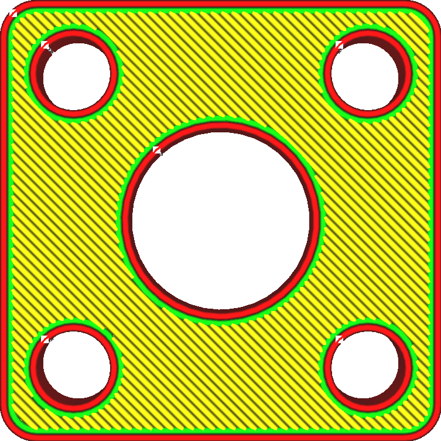

Außenhaut überlappen
====
Bei dieser Einstellung überlappt die Außenhaut ein wenig mit den angrenzenden Strukturen. Dadurch haftet die Außenhaut besser an diesen Strukturen.

<!--screenshot {
"image_path": "skin_overlap_none.png",
"models": [{"script": "mounting_plate.scad"}],
"camera_position": [0, 0, 84],
"settings": {
    "skin_outline_count": 0,
    "skin_overlap": 0
},
"colours": 64
}-->
<!--screenshot {
"image_path": "skin_overlap_20.png",
"models": [{"script": "mounting_plate.scad"}],
"camera_position": [0, 0, 84],
"settings": {
    "skin_outline_count": 0,
    "skin_overlap": 40
},
"colours": 64
}-->

Diese Überlappung führt technisch gesehen zu einer Überextrusion, die jedoch so gering ist, dass man sie nicht sehen kann. Sie hat jedoch einen erheblichen Einfluss auf die Festigkeit, da die Außenhaut besser an den Wänden und der Füllung haften kann. Schließlich tragen diese Strukturen nur dann zur Festigkeit des Modells bei, wenn sie etwas haben, an dem sie sich festhalten können.

Eine gewisse Überlappung kann auch dazu beitragen, das Auftreten von Lücken in der Außenhaut zu verringern.