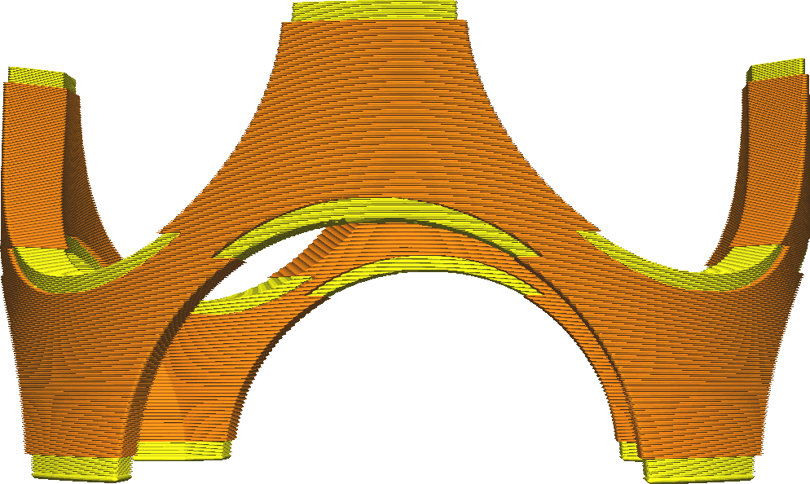
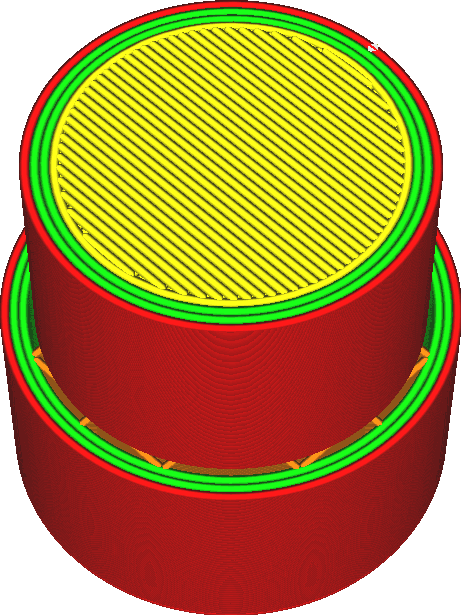

Breite für das Entfernen der Außenhaut
====
Mit dieser Einstellung werden sehr dünne Streifen der Außenhaut entfernt und stattdessen durch Füllmaterial ersetzt.

Die Außenhaut wird nur dann entfernt, wenn sich daneben Füllmaterial befindet. Es wird also nicht die Außenhaut ganz oben oder unten im Druck entfernt, selbst wenn diese sehr dünn ist.

<!--screenshot {
"image_path": "skin_preshrink_original.png",
"models": [{"script": "stature_symmetrical.scad"}],
"camera_position": [104, -7, 4],
"settings": {
    "wall_line_count": 0,
    "infill_wall_line_count": 1,
    "bottom_skin_preshrink": 0,
    "top_skin_preshrink": 0
},
"colours": 32
}-->
<!--screenshot {
"image_path": "skin_preshrink_shrunk.png",
"models": [{"script": "stature_symmetrical.scad"}],
"camera_position": [104, -7, 4],
"settings": {
    "wall_line_count": 0,
    "infill_wall_line_count": 1,
    "bottom_skin_preshrink": 1,
    "top_skin_preshrink": 1
},
"colours": 32
}-->

Die Außenhaut wird normalerweise überall dort erzeugt, wo sie sich vertikal in der Nähe des oberen oder unteren Randes des Objekts befindet. Das ist nicht überall notwendig. Senkrechte Wände sind in der Regel stark genug, so dass die Außenhaut zwar normalerweise an den Eckpunkten der senkrechten Wände angebracht werden sollte, aber mit dieser Einstellung können Sie dies umgehen. Dies spart Druckzeit und Material.

Für die meisten Drucke ist die Einstellung auf 1 oder 2 Linienbreiten hilfreich, um die Druckzeit zu verkürzen. Wenn die Außenhaut zu dünn für den Druck wird, hinterlässt Cura eine Lücke an der Stelle, an der die Außenhaut hätte sein sollen (aber zu klein war). Die Füllung wird dann nicht richtig mit den Wänden verbunden. Wenn [Lücken zwischen Wänden füllen](../shell/fill_perimeter_gaps.md) aktiviert ist, werden diese Lücken aufgefüllt, aber diese Methode des Füllens benötigt mehr Zeit zum Drucken als die normale Außenhaut. Dies wird verhindert, wenn Sie diese Einstellung mindestens auf die [Breite der oberen/unteren Linie](../resolution/skin_line_width.md) einstellen.

Wenn die Einstellung zu stark erhöht wird, können an der Ober- und Unterseite Lücken entstehen, in denen die Füllung sichtbar wird. Seien Sie vor allem bei Modellen mit dünnen Leisten vorsichtig, die einen dünnen Streifen Außenhaut erhalten sollten.

<!--screenshot {
"image_path": "skin_preshrink_problem_screenshot.png",
"models": [{"script": "thin_ridge.scad"}],
"camera_position": [64, 0, 100],
"settings": {
    "wall_line_count": 3,
    "top_skin_preshrink": 2
},
"colours": 64
}-->

