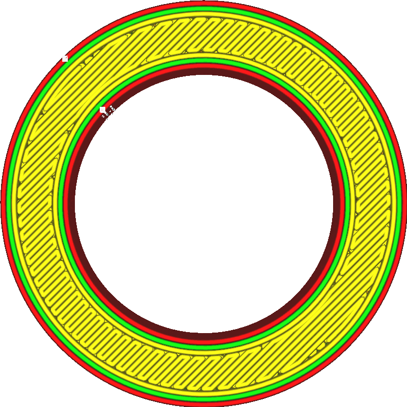

Unteres/oberes Muster
====
Mit dieser Einstellung können Sie festlegen, wie die Ober- und Unterseite mit Material gefüllt werden soll. Es stehen mehrere verschiedene Druckmuster zur Verfügung, die Muster sind hier aber begrenzter als bei der Füllung. Es sind nur Muster verfügbar, die feste Schichten erzeugen.

<!--screenshot {
"image_path": "top_bottom_pattern_lines.png",
"models": [{"script": "ring_5mm.scad"}],
"camera_position": [0, 0, 100],
"settings": {"top_bottom_pattern": "lines"},
"colours": 64
}-->
Linien
----

=======

Das Basismuster Linien zeichnet gerade Linien über die Oberfläche. Diese Linien sind standardmäßig so ausgerichtet, dass sie von der Füllung und dem Support gut unterstützt werden. Die Richtung der Linien wechselt zwischen den Schichten.
* Bietet eine schöne Oberflächenqualität.
* Sehr starr in den Richtungen, in die die Linien gezogen werden.
* Haftet stark an den Wänden, wodurch relativ starke Teile entstehen.

<!--screenshot {
"image_path": "top_bottom_pattern_concentric.png",
"models": [{"script": "ring_5mm.scad"}],
"camera_position": [0, 0, 100],
"settings": {"top_bottom_pattern": "concentric"},
"colours": 64
}-->
Konzentrisch
----

Das konzentrische Muster setzt sich im Inneren des Modells fort und zeichnet Konturen.
* Gleichmäßig stark in alle Richtungen.
* Verhindert das Entstehen von Lufteinschlüssen und Lücken. Es ist einfacher, mit diesem Muster wasserdichte Objekte zu erstellen.
* Hervorragende Überhangqualität, da sich die Linien sehr gut überbrücken lassen.
* Wenn das Teil kreisförmig ist, kann in der Mitte, wo die Konturen zusammenlaufen, eine unschöne Stelle entstehen.
* Die Oberflächenqualität ist nicht ideal.

<!--screenshot {
"image_path": "top_bottom_pattern_zigzag.png",
"models": [{"script": "ring_5mm.scad"}],
"camera_position": [0, 0, 100],
"settings": {"top_bottom_pattern": "zigzag"},
"colours": 64
}-->
Zigzag
----

Das Zickzack-Muster ist dem Linienmuster sehr ähnlich, aber anstatt die Linien in den Wänden enden zu lassen, werden sie in Richtung der nächsten Außenhaut weiter extrudiert.
* Bietet eine großartige Oberflächenqualität.
* Sehr starr in den Richtungen, in die die Linien gezogen werden.
* Hält die Extrusionsrate konstanter, was die Konsistenz der Oberfläche bei Materialien verbessert, die schwieriger zu extrudieren sind.
* Haftet nicht so gut an den Wänden wie das Linienmuster. Der Effekt [Außenhaut überlappen](skin_overlap.md) wird reduziert. Dadurch wird das Teil schwächer und die Qualität der Überhänge verringert sich.