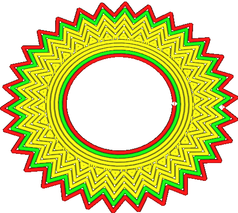

Unteres Muster für erste Schicht
====
Diese Einstellung konfiguriert, welches Muster für die Unterseite des Modells verwendet wird, wo es direkt auf der Bauplatte oder dem Raft aufliegt. Das Muster für diese Schicht, wird getrennt von den übrigen unteren Schichten konfiguriert.

<!--screenshot {
"image_path": "top_bottom_pattern_0.gif",
"models": [
    {
        "script": "gear_hollow.scad",
        "transformation": ["scale(0.5)"]
    }
],
"camera_position": [40, -40, 110],
"settings": {"top_bottom_pattern_0": "concentric"},
"layer": [1, 2, 3],
"colours": 64
}-->

Das konzentrische Muster haftet in der Regel viel besser auf der Bauplatte als andere Muster, da die Spannung in den Linien beim Schrumpfen in alle Richtungen verteilt wird. Dies verhindert ein Verziehen und verbessert die Zuverlässigkeit des Drucks. Andere Muster ziehen sich nur in eine Richtung zusammen.

Beim Drucken mit einem Raft führt die Verwendung des Linienmusters tendenziell zu einem etwas stärkeren Teil. Die Linien sind dann auch so ausgerichtet, dass sie die Lücken zwischen den Raft-Linien gut überbrücken, wodurch eine glattere Unterseite entsteht.